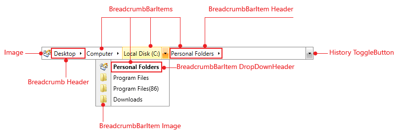

# Visual Structure

This section defines terms and concepts used in the scope of __RadBreadcrumb__you have to get familiar with prior to continue reading this help.
	  

## 

__RadBreadcrumb__is a powerful control which lets you create navigation systems and display hierarchical structures, such as directories. Below you can see a snapshot and explanation of the main visual elements of the standard __RadBreadcrumb__control.
		

The structure of the __RadBreadcrumb__is pretty simple. It consists of the following main elements:
		

* __BreadcrumbItems - RadBreadcrumb__control provides a way to display information in a hierarchical structure by using collapsible items. Each __Breadcrumb__item is an instance of the __RadBreadcrumbItem__class. You can navigate between these items using either your mouse device or your keyboard.
			

* __Breadcrumb Header -__The __Breadcrumb__control has a __Header__property which is the root of the breadcrumb navigation [Read More]()

* __BreadcrumbItem Header and DropDownHeader -__each__BreadcrumbItem__has a Header and a __DropDownHeader__ property. The __DropDownHeader__ is used when the item is displayed in the __DropDown__content of its parent item, while the __Header__is used when the item is displayed in the __Breadcrumb__ control. [Read More]()

* __Image -__the __CurrentItem__'s __Image__is displayed in front of the __Breadcrumb Header__. If no __BreadcrumbItem__is selected, the __Breadcrumb Header__item's __Image__is displayed. You can easily show/hide the __Image__, using a single property to do so - __IsIconVisible__.
			

* __History ToggleButton__ - displays the list of __RadBreadcrumb.HistoryItems__

# See Also

 * [Features Overview]()
