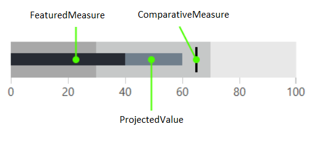
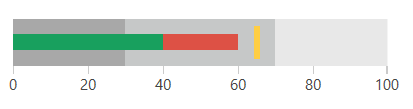

# Measures

The measures allows you to show the data performance on the bullet graph control. There are several measure indicators that can be set by setting the following properties.

* __FeaturedMeasure__

	This measure is presented by a bar and usually can be used to show the actual data value. The visual appearance of the featured measure changes if the scale doesn't contain the 0 value. In this case the measure is rendered as an ellipse on the corresponding value. 
	
	The other indincators on the graph allow the end user to the match the actual value against other qualitative and quantitative indicators.
	
* __ComparativeMeasure__
	
	This measure visualizes as a short line drawn perpendicular to the orientation of the bullet graph. This measure can be used to compare a value against the actual value, represented by the FeaturedMeasure.
	
* __ProjectedValue__
	
	This value is presented by a bar that can be used to show additional information about the data.

__Example 1: Setting measures__
```XAML
	<telerik:RadHorizontalBulletGraph FeaturedMeasure="40" 
									  ComparativeMeasure="65"                                           
									  ProjectedValue="60">
		<telerik:RadHorizontalBulletGraph.QualitativeRanges>
			<telerik:QualitativeRange Brush="#A8A8A8" Value="30" />
			<telerik:QualitativeRange Brush="#C6C8C8" Value="70" />
			<telerik:QualitativeRange Brush="#E8E8E8" Value="100"/>
		</telerik:RadHorizontalBulletGraph.QualitativeRanges>
	</telerik:RadHorizontalBulletGraph>
```

#### Figure 1: RadBulletGraph

	
## Customize Measure Colors

Each measure has a corresponding brush property that allows you to set its color. The properties follow the measure property naming with Brush at the end. 

* __ProjectedValueBrush__
* __FeaturedMeasureBrush__
* __ComparativeMeasureBrush__

Additionally, you can control the thickness of the ComparativeMeasure via the __ComparativeMeasureThickness__ property.

__Example 2: Customizing the measure colors__
```XAML
	<telerik:RadHorizontalBulletGraph FeaturedMeasure="40" 
									  ComparativeMeasure="65"                                           
									  ProjectedValue="60"									  
									  FeaturedMeasureBrush="#18A05E"
									  ProjectedValueBrush="#DD5145"
									  ComparativeMeasureBrush="#FFCE44"
									  ComparativeMeasureThickness="5">
		<telerik:RadHorizontalBulletGraph.QualitativeRanges>
			<telerik:QualitativeRange Brush="#A8A8A8" Value="30" />
			<telerik:QualitativeRange Brush="#C6C8C8" Value="70" />
			<telerik:QualitativeRange Brush="#E8E8E8" Value="100"/>
		</telerik:RadHorizontalBulletGraph.QualitativeRanges>
	</telerik:RadHorizontalBulletGraph>
```

#### Figure 2: Customized measure colors


## See Also  
* [Getting Started]()
* [Qualitative Scale]()
* [Qualitative Ranges]()

