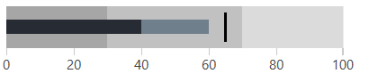

# Qualitative Ranges

The qualitative ranges are visual annotations used to separate the scale into different zones. They usually indicate the state of the covered range - bad, satisfactory, good. 

>tip The bullet graph visualization specification recommends limiting the qualitative ranges to a maximum of five and ideally to three.

## Defining Ranges

The ranges are defined manually in the __QualitativeRanges__ collection of the control. Each range is presented by the QualitativeRange control which exposes the following properties - __Brush__ and __Value__.

__Example 1: Showing qualitative ranges__
```XAML
	<telerik:RadHorizontalBulletGraph FeaturedMeasure="40" 
									  ComparativeMeasure="65"                                           
									  ProjectedValue="60">
		<telerik:RadHorizontalBulletGraph.QualitativeRanges>
			<telerik:QualitativeRange Brush="#83904D" Value="30" />
			<telerik:QualitativeRange Brush="#A2B44C" Value="70" />
			<telerik:QualitativeRange Brush="#D8E841" Value="100"/>
		</telerik:RadHorizontalBulletGraph.QualitativeRanges>
	</telerik:RadHorizontalBulletGraph>
```

> The QualitativeRange is drawn from the Minimum of the scale to the value set in the Value property. If the Value property is not set, the range will be drawn to the Maximum of the scale.

#### Figure 1: Qualitative ranges


## Predefined Quality Brushes

The bullet graph provides few properties that contain predefined brushes for each of the 3 ranges (the ideal number of ranges). Those properties are used only to store the quality brushes. They are not bound with a functionality in the control. In order to use the brushes you will need to manually bind them to the QualitativeRange controls. 

The advantage of the predefined brushes is that their colors are designed according to the requirements of the bullet graph specification. Additionally, there are different colors for the different Telerik [themes]().

The quality brushes are stored in the following properties.

* __QualityPoorBrush__

* __QualitySatisfactoryBrush__

* __QualityGoodBrush__

__Example 2: Using the quality brushes__
```XAML
	<telerik:RadHorizontalBulletGraph x:Name="radBulletGraph" 
									  FeaturedMeasure="40" 
									  ComparativeMeasure="65" 
									  ProjectedValue="60">
		<telerik:RadHorizontalBulletGraph.QualitativeRanges>
			<telerik:QualitativeRange Brush="{Binding ElementName=radBulletGraph, Path=QualityPoorBrush}" Value="30" />
			<telerik:QualitativeRange Brush="{Binding ElementName=radBulletGraph, Path=QualitySatisfactoryBrush}" Value="70" />
			<telerik:QualitativeRange Brush="{Binding ElementName=radBulletGraph, Path=QualityGoodBrush}" />
		</telerik:RadHorizontalBulletGraph.QualitativeRanges>
	</telerik:RadHorizontalBulletGraph>
```

#### Figure 2: Predefined quality brushes in the Office2016 theme


## See Also  
* [Getting Started]()
* [Qualitative Scale]()
* [Measures]()
