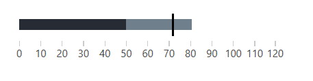
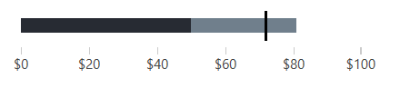
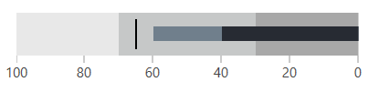

# Qualitative Scale

This article describes the properties exposed by the control for adjusting the qualitative scale.

## Setting Manual Range

The scale of the bulletgraph control auto calculates its range by default. To manually set the range of the scale use set the __AutoRange__ property of the bulletgraph control to False and the __Minimum__ and __Maximum__ properties.

To control the interval between the ticks on the scale use the __Step__ property.

__Example 1: Setting the scale range manually__
<snippet id='radbulletgraph-features-radbulletgraph-qualitative-scale-example_1_setting_the_scale_range_manually-xaml' />

#### Figure 1: Setting the scale range between 0 and 120

## Hiding the Scale

To hide the scale's ticks and labels, set the __QuantitativeScaleVisibility__ property.

__Example 2: Hiding the scale__
<snippet id='radbulletgraph-features-radbulletgraph-qualitative-scale-example_2_hiding_the_scale-xaml' />

#### Figure 2: BulletGraph with hidden scale

	

> Setting the visibility to Hidden and Collapsed leads to different visual results. When Collapsed, the control won't allocate the space for the scale, therefore the bar will be more wide. When the visibility is set to Hidden, the control will reserve space for the scale, therefore the bar won't stretch in all available space.


## Formating the Labels

To format the tick labels displayed under the scale, use the __TextFormatString__ property. The property allows you to set any of the [standart numeric string format strings](https://docs.microsoft.com/en-us/dotnet/standard/base-types/standard-numeric-format-strings).

__Example 3: Using currency format__
<snippet id='radbulletgraph-features-radbulletgraph-qualitative-scale-example_3_using_currency_format-xaml' />

#### Figure 3: Labels formatted using currency format

	
## Inversing the Scale 
	
To inverse the scale you can set the __FlowDirection__ property of the control. 

__Example 4: Setting FlowDirection__
<snippet id='radbulletgraph-features-radbulletgraph-qualitative-scale-example_4_setting_flowdirection-xaml' />

#### Figure 4: Inversed scale

	
## See Also  
* [Getting Started]()
* [Qualitative Ranges]()
* [Measures]()
