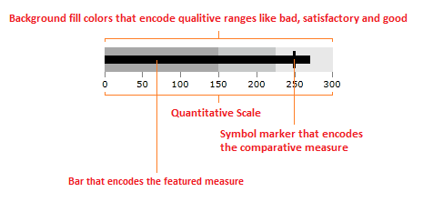

# Getting Started with {{ site.framework_name }} BulletGraph

This tutorial will walk you through the creation of a RadBulletGraph.

## Assembly References
 
In order to use RadBulletGraph in your project you have to add a reference to the following assemblies:

* __Telerik.Licensing.Runtime__
* __Telerik.Windows.Controls__
* __Telerik.Windows.Controls.DataVisualization__ 
* __Telerik.Windows.Data__

You can find the required assemblies for each control from the suite in the [Controls Dependencies]()[Controls Dependencies]() help article.

>tip With the 2025 Q1 release, the Telerik UI for WPF has a new licensing mechanism. You can learn more about it [here]().

### Adding Telerik Assemblies Using NuGet

To use __RadBulletGraph__ when working with NuGet packages, install the `Telerik.Windows.Controls.DataVisulization.for.Wpf.Xaml` package. The [package name may vary]() slightly based on the Telerik dlls set - [Xaml or NoXaml]()

Read more about NuGet installation in the [Installing UI for WPF from NuGet Package]() article.

## BulletGraph Types

The RadBulletGraph suite provides two controls - one horizontally arranged and one vertically.

* __RadHorizontalBulletGraph__

* __RadVerticalBulletGraph__

## Visual Structure

The following image describes the main elements of the RadBulletGraph control.

#### __Figure 1: BulletGraph visual elements__

## Defining the RadBulletGraph

The following examples show how to define a simple horizontal and vertical bullet graphs.

#### __[XAML] Example 1: Defining horizontal bullet graph control__
{{region radbulletgraph-getting-started-0}}
	<telerik:RadHorizontalBulletGraph FeaturedMeasure="60"
									  ComparativeMeasure="65" 
									  ProjectedValue="75"
									  Maximum="100">
		<telerik:RadHorizontalBulletGraph.QualitativeRanges>
			<telerik:QualitativeRange Brush="#A8A8A8" Value="150" />
			<telerik:QualitativeRange Brush="#C6C8C8" Value="225" />
			<telerik:QualitativeRange Brush="#E8E8E8" />
		</telerik:RadHorizontalBulletGraph.QualitativeRanges>
	</telerik:RadHorizontalBulletGraph>
{{endregion}}

#### __Figure 2: RadHorizontalBulletGraph__

#### __[XAML] Example 2: Defining vertical bullet graph control__
{{region radbulletgraph-getting-started-1}}
	<telerik:RadVerticalBulletGraph FeaturedMeasure="60" 
									ComparativeMeasure="65" 
									ProjectedValue="75"
									Maximum="100">
		<telerik:RadVerticalBulletGraph.QualitativeRanges>
			<telerik:QualitativeRange Brush="#A8A8A8" Value="150" />
			<telerik:QualitativeRange Brush="#C6C8C8" Value="225" />
			<telerik:QualitativeRange Brush="#E8E8E8" />
		</telerik:RadVerticalBulletGraph.QualitativeRanges>
	</telerik:RadVerticalBulletGraph>
{{endregion}}

#### __Figure 3: RadVerticalBulletGraph__


## Telerik UI for WPF Learning Resources

* [Telerik UI for WPF BulletGraph Component](https://www.telerik.com/products/wpf/bulletgraph.aspx)
* [Getting Started with Telerik UI for WPF Components]()
* [Telerik UI for WPF Installation]()
* [Telerik UI for WPF and WinForms Integration]()
* [Telerik UI for WPF Visual Studio Templates]()
* [Setting a Theme with Telerik UI for WPF]()
* [Telerik UI for WPF Virtual Classroom (Training Courses for Registered Users)](https://learn.telerik.com/learn/course/external/view/elearning/16/telerik-ui-for-wpf) 
* [Telerik UI for WPF License Agreement](https://www.telerik.com/purchase/license-agreement/wpf-dlw-s)


## See Also
* [Overview]()
* [Qualitative Ranges]()
* [Measures]()
* [Creating a BulletGraph Programmatically]()
