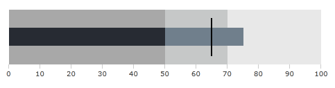

# Creating a BulletGraph Programmatically

The following article will demonstrate how to create a simple Horizontal Bullet graph programmatically but the approach is the same for the Vertical Bullet graph too.

1. The first thing you have to do is to create a new instance of the __RadHorizontalBulletGraph__ class in the code and add it to a parent control.

	__Example 1: Creating a new instance of RadHorizontalBulletGraph and adding it to the parent container__  
	```C#
		RadHorizontalBulletGraph horizontalBulletGraph = new RadHorizontalBulletGraph();
		this.LayoutRoot.Children.Add(horizontalBulletGraph);
	```
	```VB.NET
		Dim horizontalBulletGraph As New RadHorizontalBulletGraph()
		Me.LayoutRoot.Children.Add(horizontalBulletGraph)
	```

2. Configure the BulletGraph by setting sample values for it's properties.

	__Example 2: Setting up the bullet graph__  
	```C#
		horizontalBulletGraph.AutoRange = false;
		horizontalBulletGraph.Width = 300;
		horizontalBulletGraph.Height = 60;
		horizontalBulletGraph.Minimum = 0;
		horizontalBulletGraph.Maximum = 100;
		horizontalBulletGraph.FeaturedMeasure = 60d;
		horizontalBulletGraph.ComparativeMeasure = 65d;
		horizontalBulletGraph.ProjectedValue = 75d;
		QualitativeRange range = new QualitativeRange();
		range.Value = 50;
		range.Brush = CombineAlphaAndColorInSolidColorBrush(1, "#A8A8A8");
		horizontalBulletGraph.QualitativeRanges.Add(range);
		QualitativeRange range1 = new QualitativeRange();
		range1.Value = 70;
		range1.Brush = CombineAlphaAndColorInSolidColorBrush(1, "#C6C8C8");
		horizontalBulletGraph.QualitativeRanges.Add(range1);
		QualitativeRange range2 = new QualitativeRange();
		range2.Brush = CombineAlphaAndColorInSolidColorBrush(1, "#E8E8E8");
		horizontalBulletGraph.QualitativeRanges.Add(range2);
	```
	```VB.NET
		horizontalBulletGraph.AutoRange = False
		horizontalBulletGraph.Width = 300
		horizontalBulletGraph.Height = 60
		horizontalBulletGraph.Minimum = 0
		horizontalBulletGraph.Maximum = 100
		horizontalBulletGraph.FeaturedMeasure = 60.0
		horizontalBulletGraph.ComparativeMeasure = 65.0
		horizontalBulletGraph.ProjectedValue = 75.0
		Dim range As New QualitativeRange()
		range.Value = 50
		range.Brush = CombineAlphaAndColorInSolidColorBrush(1, "#A8A8A8")
		horizontalBulletGraph.QualitativeRanges.Add(range)
		Dim range1 As New QualitativeRange()
		range1.Value = 70
		range1.Brush = CombineAlphaAndColorInSolidColorBrush(1, "#C6C8C8")
		horizontalBulletGraph.QualitativeRanges.Add(range1)
		Dim range2 As New QualitativeRange()
		range2.Brush = CombineAlphaAndColorInSolidColorBrush(1, "#E8E8E8")
		horizontalBulletGraph.QualitativeRanges.Add(range2)
	```

	The Colors for the qualitative ranges are set with Hex Values and are converted to SolidColorBrush using the method provided in [this](http://forums.silverlight.net/forums/p/24190/488858.aspx) forum post.

The full source code for creating Horizontal BulletGraph in code-behind.

__Example 3: The full code of the example__  
```C#
	public MainPage()
	{
	    InitializeComponent();
	    RadHorizontalBulletGraph horizontalBulletGraph = new RadHorizontalBulletGraph();
	    horizontalBulletGraph.AutoRange = false;
	    horizontalBulletGraph.Width = 300;
	    horizontalBulletGraph.Height = 60;
	    horizontalBulletGraph.Minimum = 0;
	    horizontalBulletGraph.Maximum = 100;
	    horizontalBulletGraph.FeaturedMeasure = 60d;
	    horizontalBulletGraph.ComparativeMeasure = 65d;
	    horizontalBulletGraph.ProjectedValue = 75d;
	    QualitativeRange range = new QualitativeRange();
	    range.Value = 50;
	    range.Brush = CombineAlphaAndColorInSolidColorBrush(1, "#A8A8A8");
	    horizontalBulletGraph.QualitativeRanges.Add(range);
	    QualitativeRange range1 = new QualitativeRange();
	    range1.Value = 70;
	    range1.Brush = CombineAlphaAndColorInSolidColorBrush(1, "#C6C8C8");
	    horizontalBulletGraph.QualitativeRanges.Add(range1);
	    QualitativeRange range2 = new QualitativeRange();
	    range2.Brush = CombineAlphaAndColorInSolidColorBrush(1, "#E8E8E8");
	    horizontalBulletGraph.QualitativeRanges.Add(range2);
	    this.LayoutRoot.Children.Add(horizontalBulletGraph);
	}
	protected static SolidColorBrush CombineAlphaAndColorInSolidColorBrush(double opacity, string color)
	{
	    SolidColorBrush theAnswer = new SolidColorBrush();
	    // deal with opacity
	    if (opacity > 1.0)
	        opacity = 1.0;
	    if (opacity < 0.0)
	        opacity = 0.0;
	    // get the hex value of the alpha chanel (opacity):
	    byte a = (byte)(Convert.ToInt32(255 * opacity));
	    // deal with the color
	    try
	    {
	        byte r = (byte)(Convert.ToUInt32(color.Substring(1, 2), 16));
	        byte g = (byte)(Convert.ToUInt32(color.Substring(3, 2), 16));
	        byte b = (byte)(Convert.ToUInt32(color.Substring(5, 2), 16));
	        theAnswer.Color = Color.FromArgb(a, r, g, b);
	    }
	    catch
	    {
	        theAnswer.Color = Color.FromArgb(255, 255, 0, 0);
	    }
	    return theAnswer;
	}
```
```VB.NET
	Public Sub New()
	    InitializeComponent()
	    Dim horizontalBulletGraph As New RadHorizontalBulletGraph()
	    horizontalBulletGraph.AutoRange = False
	    horizontalBulletGraph.Width = 300
	    horizontalBulletGraph.Height = 60
	    horizontalBulletGraph.Minimum = 0
	    horizontalBulletGraph.Maximum = 100
	    horizontalBulletGraph.FeaturedMeasure = 60.0
	    horizontalBulletGraph.ComparativeMeasure = 65.0
	    horizontalBulletGraph.ProjectedValue = 75.0
	    Dim range As New QualitativeRange()
	    range.Value = 50
	    range.Brush = CombineAlphaAndColorInSolidColorBrush(1, "#A8A8A8")
	    horizontalBulletGraph.QualitativeRanges.Add(range)
	    Dim range1 As New QualitativeRange()
	    range1.Value = 70
	    range1.Brush = CombineAlphaAndColorInSolidColorBrush(1, "#C6C8C8")
	    horizontalBulletGraph.QualitativeRanges.Add(range1)
	    Dim range2 As New QualitativeRange()
	    range2.Brush = CombineAlphaAndColorInSolidColorBrush(1, "#E8E8E8")
	    horizontalBulletGraph.QualitativeRanges.Add(range2)
	    Me.LayoutRoot.Children.Add(horizontalBulletGraph)
	End Sub
	Protected Shared Function CombineAlphaAndColorInSolidColorBrush(opacity As Double, color__1 As String) As SolidColorBrush
	    Dim theAnswer As New SolidColorBrush()
	    ' deal with opacity '
	    If opacity > 1.0 Then
	        opacity = 1.0
	    End If
	    If opacity < 0.0 Then
	        opacity = 0.0
	    End If
	    ' get the hex value of the alpha chanel (opacity): '
	    Dim a As Byte = CByte(Convert.ToInt32(255 * opacity))
	    ' deal with the color '
	    Try
	        Dim r As Byte = CByte(Convert.ToUInt32(color__1.Substring(1, 2), 16))
	        Dim g As Byte = CByte(Convert.ToUInt32(color__1.Substring(3, 2), 16))
	        Dim b As Byte = CByte(Convert.ToUInt32(color__1.Substring(5, 2), 16))
	        theAnswer.Color = Color.FromArgb(a, r, g, b)
	    Catch
	        theAnswer.Color = Color.FromArgb(255, 255, 0, 0)
	    End Try
	    Return theAnswer
	End Function
```

The result: 
