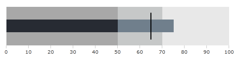

# Creating a BulletGraph Programmatically

The following article will demonstrate how to create a simple Horizontal Bullet graph programmatically but the approach is the same for the Vertical Bullet graph too.

1. The first thing you have to do is to create a new instance of the __RadHorizontalBulletGraph__ class in the code and add it to a parent control.

	__Example 1: Creating a new instance of RadHorizontalBulletGraph and adding it to the parent container__  
	<snippet id='radbulletgraph-radbulletgraph-creating-a-bulletgraph-programmatically-block_1-cs' />
	<snippet id='radbulletgraph-radbulletgraph-creating-a-bulletgraph-programmatically-block_1-vb' />

2. Configure the BulletGraph by setting sample values for it's properties.

	__Example 2: Setting up the bullet graph__  
	<snippet id='radbulletgraph-radbulletgraph-creating-a-bulletgraph-programmatically-block_2-cs' />
	<snippet id='radbulletgraph-radbulletgraph-creating-a-bulletgraph-programmatically-block_2-vb' />

	The Colors for the qualitative ranges are set with Hex Values and are converted to SolidColorBrush using the method provided in [this](http://forums.silverlight.net/forums/p/24190/488858.aspx) forum post.

The full source code for creating Horizontal BulletGraph in code-behind.

__Example 3: The full code of the example__  
<snippet id='radbulletgraph-radbulletgraph-creating-a-bulletgraph-programmatically-block_3-cs' />
<snippet id='radbulletgraph-radbulletgraph-creating-a-bulletgraph-programmatically-block_3-vb' />

The result: 

