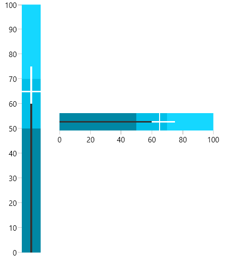

# Overview



The __RadBulletGraph__ control is a variation of linear gauge. It combines a number of indicators, as well as the data indicator into one control, which is lightweight, easily customizable and straightforward to setup and use. The control is a great tool for creating dashboards that presents a lot of information in relatively small size.





## Key Features

* __Various measurement features__: Non zero-based scale, negative featured measures, projected values, multiple comparative measures and quantitative ranges.

* __Data Binding Support__: The control can be easily data bound to your business data, either by setting its properties directly, or by using a binding declaration.

>tip Get started with the control with its [Getting Started]() help article that shows how to use it in a basic scenario.

> Check out the online demo at [demos.telerik.com](https://demos.telerik.com/silverlight/#BulletGraph/FirstLook)[demos.telerik.com](https://demos.telerik.com/wpf/)

## See Also  
* [Getting Started]()
* [Qualitative Scale]()
* [Qualitative Ranges]()
