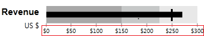

# Properties

## 

This section elaborates on the most important properties and settings in the control, their usage and meaning.

1. __FeaturedMeasure__ - this property specifies the actual value, which the bar in the Bullet graph will represent. All other visual indicators on the graph allow the end user to match this actual value against other qualitative and quantitative indicators.

2. __ComparativeMeasure__ - this property sets the value of a visual indicator, which will be compared against  the actual value, represented by the FeaturedMeasure.

3. __FlowDirection__ - this property governs how the control is rendered - for example "LeftToRight" or "RightToLeft".

4. __Step__ - This property specifies the numeric increment by which each number label would appear along the bar. For example, if the bullet graph spans for values from 0 to 300, and the step is set to 50, the numbered ticks would look like this:

         
      

5. __QualitativeRanges__
 Each graph has a collection of qualitative ranges, which look like this:

#### __C#__

{{region radbulletgraph_properties_0}}
	<telerik:RadVerticalBulletGraph FeaturedMeasure="270" ComparativeMeasure="250"> 
	<telerik:RadVerticalBulletGraph.QualitativeRanges>
	      <telerik:QualitativeRange Brush="#A8A8A8" Value="150" />
	      <telerik:QualitativeRange Brush="#C6C8C8" Value="225" />
	      <telerik:QualitativeRange Brush="#E8E8E8" />
	</telerik:RadVerticalBulletGraph.QualitativeRanges>
	</telerik:RadVerticalBulletGraph>
	{{endregion}}

Each qualitative range specifies two important properties.
The first one is the __Value__. This specifies the range from the beginning of the graph. Additionally, the last range in the collection does not need to have a value specified, as it spans from the beginning of the graph to the end value of the graph.
The second property is the __Brush__. It specifies the color of each range.
These different ranges allow the programmer to define qualitative ranges on the graph, which can be compared against the value of the bar (FeaturedMeasure).

