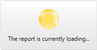
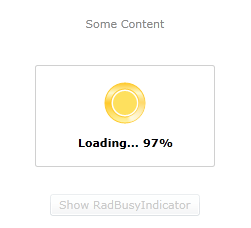

# Custom Busy Content

__RadBusyIndicator__ provides the option to customize what's shown in the __RadBusyIndicator's__ content while the indicator is active through its __BusyContent__ and __BusyContentTemplate__ properties. We will cover them in the following sections:

 * [Setting BusyContent property](#setting-busycontent-property)
 
 * [Setting BusyContentTemplate property](#setting-busycontenttemplate-property)
 
## Setting BusyContent property

__BusyContent__ property sets the loading message while the indicator is active as shown in the following example:

__Setting BusyContent__

<snippet id='radbusyindicator-features-custom-busy-content-setting_busycontent-xaml' />

Here is the result:

## Setting BusyContentTemplate property

__RadBusyIndicator__ exposes a __BusyContentTemplate__ property which allows you to customize the DataTemplate shown while the indicator is in Busy state.

In this section we will show you how to create and apply a simple __BusyContentTemplate__ to your __RadBusyIndicator__ control. For the purpose of this example we will create a __DispatcherTimer__ timer and while this timer is on, the __RadBusyIndicator__ will also be active. To start the timer the user will have to click on a button. The example also includes a counter representing the progress value which will count down from 100 to 0 percent and will be visible through the __RadBusyIndicator's__ busy content.

To do this, first you have to define your __RadBusyIndicator__ control:

__Defining RadBusyIndicator__

<snippet id='radbusyindicator-features-custom-busy-content-defining_radbusyindicator-xaml' />

>Notice that the __RadBusyIndicator's Background__ property is set to __Transparent__. This will be the background applied to the indicator's content and the __Grid__ hosting the __RadBusyIndicator's__ progress bar and content elements.

In the __RadBusyIndicator's__ definition you have indicated the __BusyContentTemplate__, that's why you have to define this __DataTemplate__ as well. Here is an example:

__Defining DataTemplate__

<snippet id='radbusyindicator-features-custom-busy-content-defining_datatemplate-xaml' />

In the code behind you have to:

* Create and initialize the __DispatcherTimer__ object.

* Handle the click event for the button:

	* Enable the __RadBusyIndicator__ by setting its __IsBusy__ property to __True__.

	* Start the timer that will count down some period of time.

* Handle the tick event for the timer:

	* Modify the counter (progress) property.

	* Disable the __RadBusyIndicator__ by setting its __IsBusy__ property to __False__ in a specific condition.

>tip You can also create a [determined RadBusyIndicator]() control which provides a straightforward way to report a changing progress value.

>In order to use the __DispatcherTimer__ and the __INotifyPropertyChanged__ interface you will need to add the following usings/imports: 
>* __System.ComponentModel__
>* __System.Windows.Threading__

__BusyContentTemplateSample class implementation__

<snippet id='radbusyindicator-features-custom-busy-content-busycontenttemplatesample_class_implementation-cs' />

<snippet id='radbusyindicator-features-custom-busy-content-busycontenttemplatesample_class_implementation-vb' />

__BusyContentTemplateSample class implementation__

Here is the final result:

## See Also

 * [Template Structure]()

 * [Progress Determination]()

 * [Report Progress Value]()

 * [Integrate with services and a RadWindow]()
