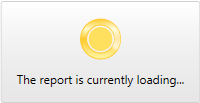

# Custom Busy Content

__RadBusyIndicator__ provides the option to customize what's shown in the __RadBusyIndicator's__ content while the indicator is active through its __BusyContent__ and __BusyContentTemplate__ properties. We will cover them in the following sections:

 * [Setting BusyContent property](#setting-busycontent-property)
 
 * [Setting BusyContentTemplate property](#setting-busycontenttemplate-property)
 
## Setting BusyContent property

__BusyContent__ property sets the loading message while the indicator is active as shown in the following example:

__Setting BusyContent__

```XAML
	<telerik:RadBusyIndicator BusyContent="The report is currently loading..." >
        <!-- the content here -->
    </telerik:RadBusyIndicator>
```

Here is the result:



## Setting BusyContentTemplate property

__RadBusyIndicator__ exposes a __BusyContentTemplate__ property which allows you to customize the DataTemplate shown while the indicator is in Busy state.

In this section we will show you how to create and apply a simple __BusyContentTemplate__ to your __RadBusyIndicator__ control. For the purpose of this example we will create a __DispatcherTimer__ timer and while this timer is on, the __RadBusyIndicator__ will also be active. To start the timer the user will have to click on a button. The example also includes a counter representing the progress value which will count down from 100 to 0 percent and will be visible through the __RadBusyIndicator's__ busy content.

To do this, first you have to define your __RadBusyIndicator__ control:

__Defining RadBusyIndicator__

```XAML
	<telerik:RadBusyIndicator x:Name="radBusyIndicator"
	                          Background="Transparent"
	                          BusyContentTemplate="{StaticResource BusyContentDataTemplate}">
	    <Grid>
	         <TextBlock Text="Some Content"
	                    TextAlignment="Center" />
	         <Button Content="Show RadBusyIndicator"
	                 VerticalAlignment="Bottom"
	                 Click="showIndicatorButton_Click"
	                 Width="150" />
	    </Grid>
	</telerik:RadBusyIndicator>
```

>Notice that the __RadBusyIndicator's Background__ property is set to __Transparent__. This will be the background applied to the indicator's content and the __Grid__ hosting the __RadBusyIndicator's__ progress bar and content elements.

In the __RadBusyIndicator's__ definition you have indicated the __BusyContentTemplate__, that's why you have to define this __DataTemplate__ as well. Here is an example:

__Defining DataTemplate__

```XAML
	<DataTemplate x:Key="BusyContentDataTemplate">
	    <StackPanel Orientation="Horizontal"
	                DataContext="{Binding DataContext, ElementName=radBusyIndicator}">
	        <TextBlock Text="Loading... "
	                   FontWeight="Bold" />
	        <TextBlock Text="{Binding ProgressValue}"
	                   FontWeight="Bold" />
	        <TextBlock Text="%"
	                   FontWeight="Bold" />
	    </StackPanel>
	</DataTemplate>
```

In the code behind you have to:

* Create and initialize the __DispatcherTimer__ object.

* Handle the click event for the button:

	* Enable the __RadBusyIndicator__ by setting its __IsBusy__ property to __True__.

	* Start the timer that will count down some period of time.

* Handle the tick event for the timer:

	* Modify the counter (progress) property.

	* Disable the __RadBusyIndicator__ by setting its __IsBusy__ property to __False__ in a specific condition.

>tipYou can also create a [determined RadBusyIndicator]() control which provides a straightforward way to report a changing progress value.

>In order to use the __DispatcherTimer__ and the __INotifyPropertyChanged__ interface you will need to add the following usings/imports: 
>* __System.ComponentModel__
>* __System.Windows.Threading__

__BusyContentTemplateSample class implementation__

```C#
	public partial class BusyContentTemplateSample : UserControl, INotifyPropertyChanged
	{
	    private int progressValue;
	    private DispatcherTimer progressTimer;
	    public event PropertyChangedEventHandler PropertyChanged;
	    public BusyContentTemplateSample()
	    {
	        InitializeComponent();
	        this.DataContext = this;
	
	        this.progressTimer = new DispatcherTimer();
	        this.progressTimer.Interval = TimeSpan.FromSeconds( 1 );
	        this.progressTimer.Tick += new EventHandler( this.progressTimer_Tick );
	    }
	    public int ProgressValue
	    {
	        get
	        {
	            return this.progressValue;
	        }
	        set
	        {
	            if ( this.progressValue == value )
	                return;
	            this.progressValue = value;
	            if ( this.PropertyChanged != null )
	                this.PropertyChanged( this, new PropertyChangedEventArgs( "ProgressValue" ) );
	        }
	    }
	    private void showIndicatorButton_Click( object sender, RoutedEventArgs e )
	    {
	        this.progressTimer.Start();
	        this.ProgressValue = 100;
	        this.radBusyIndicator.IsBusy = true;
	    }
	    private void progressTimer_Tick( object sender, EventArgs e )
	    {
	        this.ProgressValue--;
	        if ( this.ProgressValue == 0 )
	        {
	            this.progressTimer.Stop();
	            this.radBusyIndicator.IsBusy = false;
	        }
	    }
	}
```

__BusyContentTemplateSample class implementation__

```VB
	Public Partial Class BusyContentTemplateSample
	 Inherits UserControl
	 Implements INotifyPropertyChanged
	 Private m_progressValue As Integer
	 Private progressTimer As DispatcherTimer
	 Public Event PropertyChanged As PropertyChangedEventHandler
	 Public Sub New()
	  InitializeComponent()
	  Me.DataContext = Me
	  Me.progressTimer = New DispatcherTimer()
	  Me.progressTimer.Interval = TimeSpan.FromSeconds(1)
	  Me.progressTimer.Tick += New EventHandler(Me.progressTimer_Tick)
	 End Sub
	 Public Property ProgressValue() As Integer
	  Get
	   Return Me.m_progressValue
	  End Get
	  Set
	   If Me.m_progressValue = value Then
	    Return
	   End If
	   Me.m_progressValue = value
	   RaiseEvent PropertyChanged(Me, New PropertyChangedEventArgs("ProgressValue"))
	  End Set
	 End Property
	 Private Sub showIndicatorButton_Click(sender As Object, e As RoutedEventArgs)
	  Me.progressTimer.Start()
	  Me.ProgressValue = 100
	  Me.radBusyIndicator.IsBusy = True
	 End Sub
	 Private Sub progressTimer_Tick(sender As Object, e As EventArgs)
	  Me.ProgressValue -= 1
	  If Me.ProgressValue = 0 Then
	   Me.progressTimer.[Stop]()
	   Me.radBusyIndicator.IsBusy = False
	  End If
	 End Sub
	End Class
```

Here is the final result:


## See Also

 * [Template Structure]()

 * [Progress Determination]()

 * [Report Progress Value]()

 * [Integrate with services and a RadWindow]()
