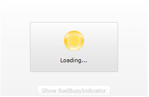

# Delayed Display

When using the __RadBusyIndicator__ in your applications you can notify the users about an ongoing process with a specific delay. By changing the __DisplayAfter__ property to a certain __TimeSpan__, the __RadBusyIndicator__ is shown after the corresponding amount of time elapses. 

The default value of this delay is 100 milliseconds but you can easily change it in XAML or code-behind.

The following example will create a __RadBusyIndicator__ and its only content will be a __Button__. When this __Button__ is pressed the __RadBusyIndicator__ will be activated after the predefined delay time.

First you have to declare the controls in XAML or code-behind:

__Defining RadBusyIndicator and a Button as content__

```XAML
	<telerik:RadBusyIndicator x:Name="radBusyIndicator"
	                          DisplayAfter="00:00:05">
	    <Grid>
	        <Button Content="Show RadBusyIndicator"
	                VerticalAlignment="Bottom"
	                Click="showIndicatorButton_Click"/>
	    </Grid>
	</telerik:RadBusyIndicator>
```

>Notice that the __DisplayAfter__ property is of type __TimeSpan__. Considering this fact, in this example you have to set the __RadBusyIndicator__ to be delayed with 5 seconds (00:00:05).

Finally, in the code-behind you have to handle the click event for the button and activate the __RadBusyIndicator__ control:

>tipTo read more about enabling the __RadBusyIndicator__ look [here]().

__Enable RadBusyIndicator__

```C#
	private void showIndicatorButton_Click( object sender, RoutedEventArgs e )
	{
	    this.radBusyIndicator.IsBusy = true;
	}
```

As a result when the user clicks on a button after a delay of five seconds, the __RadBusyIndicator__ will be displayed:



>tip __RadBusyIndicator__ also gives you a read-only boolean property - __IsBusyIndicationVisible__. Its value will be equal to __True__ whenever the __RadBusyIndicator__ is enabled and visualized.To check whether the __RadBusyIndicator__ is enabled, you can observe its __IsBusy__ boolean property.

## See Also

 * [Enabling the Indicator]()

 * [Modify the default placement]()
