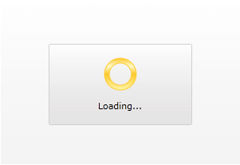

# Progress Determination

__RadBusyIndicator__ control supports two main modes of execution. It can be either determined or indetermined. These correspond to the following scenarios: 

* a specific period of time

* an indetermined amount of time 

The default scenario is the second one - the __RadBusyIndicator__ is indetermined. You can control this via the __IsIndeterminated__ boolean property. Its default value is __True__. 

If you need a determined __RadBusyIndicator__ you have to set the value of the __IsIndeterminated__ property to __False__. In this case you can modify the __ProgressValue__ property, which will indicate how much of the predefined time have already elapsed. You can set its value through XAML or code-behind. However, to get the most out of it, you have to bind it to a percentage value (between 0 and 100) indicating the state of the ongoing process.

>tip Read more about reporting the current stage of loading via the __ProgressValue__ property [here](). 

Here is an example of creating a determined __RadBusyIndicator__ control:

__Setting IsIndeterminate__

```XAML
	<telerik:RadBusyIndicator IsIndeterminate="False" />
```

Notice that when a determined __RadbusyIndicator__ is enabled its inner donut will be consecutively filled. 



How much of the inner donut is filled depends on the __ProgressValue__ property. If it is less or equal to 0 the donut will be empty and when it is grater or equal to 100 the donut will be filled. 

## See Also

 * [Enabling the Indicator]()

 * [Report Progress Value]()

 * [Custom Busy Content]()
