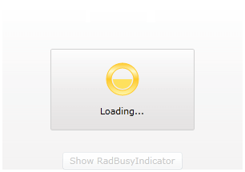

# Report Progress Value

This topic will describe the scenario in which you have a determined __RadBusyIndicator__ control which you want to be available for a predefined amount of time. In this case the __RadBusyIndicator__ provides you out of the box with a way to visualize the progress.

>tip To read more about the determined and indetermined __RadBusyIndicator__ control's modes, look [here]().

In the following example the only content of the __RadBusyIndicator__ control is a __Button__. When the user clicks on that button the __RadBusyIndicator__ will be enabled for a predefined amount of time. In this example, this is achieved by using a __DispatcherTimer__ timer object which __Tick__ event will change the __RadBusyIndicator's__ progress value.

The first thing you have to do is to specify that you want your indicator to be determined. You do this by setting its __IsIndetermined__ boolean property to __False__.

__Setting IsIndeterminate__

```XAML
	<telerik:RadBusyIndicator x:Name="radBusyIndicator" 
	                          IsIndeterminate="False" 
	                          ProgressValue="{Binding ProgressValue}">
	    <Grid>               
	        <Button Content="Show RadBusyIndicator"
	                VerticalAlignment="Bottom"
	                Click="showIndicatorButton_Click" />
	    </Grid>
	</telerik:RadBusyIndicator>
```

Notice that you have also defined the __ProgressValue__ property. For the purpose of this example, by using data binding you have bound it to a property named in the same way located in the code-behind. Through this binding you will be changing this property to report any shifts in the __RadBusyIndicator's__ progress value. 

>tipYou can further change the default way of the progress changes notifications by customizing the [Busy Content]().

In the code behind you have to:

* Create and initialize the __DispathcherTimer__ object.

* Handle the click event for the button:          	

	* Enable __RadBusyIndicator__ by setting its __IsBusy__ property to __True__.

	* Start the timer which will represent the ongoing process.

* Handle the tick event for the timer:          	

	* Modify the progress value.

	* Disable the __RadBusyIndicator__ by setting its __IsBusy__ property to __False__ in a specific condition.

>In order to use the __DispatcherTimer__ and the __INotifyPropertyChanged__ interface you will need to add the following usings/imports: 
>* __System.ComponentModel__
>* __System.Windows.Threading__

__ProgressDetermination class implementation__

```C#
	public partial class ProgressDetermination : UserControl, INotifyPropertyChanged
	{
	    private int progressValue;
	    private DispatcherTimer progressTimer;
	    public event PropertyChangedEventHandler PropertyChanged;
	    public ProgressDetermination()
	    {
	        InitializeComponent();
	        this.DataContext = this;
	        this.progressTimer = new DispatcherTimer();
	        this.progressTimer.Interval = TimeSpan.FromSeconds( 0.1 );
	        this.progressTimer.Tick += new EventHandler( this.progressTimer_Tick );
	    }
	    public int ProgressValue
	    {
	        get
	        {
	            return this.progressValue;
	        }
	        set
	        {
	            if ( this.progressValue == value )
	                return;
	            this.progressValue = value;
	            if ( this.PropertyChanged != null )
	                this.PropertyChanged( this, new PropertyChangedEventArgs( "ProgressValue" ) );
	        }
	    }
	    private void showIndicatorButton_Click( object sender, RoutedEventArgs e )
	    {
	        this.progressTimer.Start();
	        this.ProgressValue = 0;
	        this.radBusyIndicator.IsBusy = true;
	    }
	    private void progressTimer_Tick( object sender, EventArgs e )
	    {
	        this.ProgressValue++;
	        if ( this.ProgressValue == 100 )
	        {
	            this.progressTimer.Stop();
	            this.radBusyIndicator.IsBusy = false;
	        }
	    }
	}
```

__ProgressDetermination class implementation__

```VB
	Public Class ProgressDetermination
		Implements INotifyPropertyChanged
	
		Private m_progressValue As Integer
		Private progressTimer As DispatcherTimer
		Public Event PropertyChanged As PropertyChangedEventHandler _
			 Implements INotifyPropertyChanged.PropertyChanged
	
		Public Sub New()
			InitializeComponent()
			Me.DataContext = Me
			Me.progressTimer = New DispatcherTimer()
			Me.progressTimer.Interval = TimeSpan.FromSeconds(1)
			AddHandler progressTimer.Tick, AddressOf progressTimer_Tick
	
		End Sub
		Public Property ProgressValue() As Integer
			Get
				Return Me.m_progressValue
			End Get
			Set(value As Integer)
				If Me.m_progressValue = value Then
					Return
				End If
				Me.m_progressValue = value
				RaiseEvent PropertyChanged(Me, New PropertyChangedEventArgs("ProgressValue"))
			End Set
		End Property
		Private Sub showIndicatorButton_Click(sender As Object, e As RoutedEventArgs)
			Me.progressTimer.Start()
			Me.ProgressValue = 0
			Me.radBusyIndicator.IsBusy = True
		End Sub
		Private Sub progressTimer_Tick(sender As Object, e As EventArgs)
			Me.ProgressValue += 10
			If Me.ProgressValue = 100 Then
				Me.progressTimer.[Stop]()
				Me.radBusyIndicator.IsBusy = False
			End If
		End Sub
	End Class
```

Here is the final result:



## See Also

 * [Enabling the Indicator]()

 * [Progress Determination]()

 * [Custom Busy Content]()
