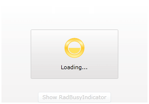

# Report Progress Value

This topic will describe the scenario in which you have a determined __RadBusyIndicator__ control which you want to be available for a predefined amount of time. In this case the __RadBusyIndicator__ provides you out of the box with a way to visualize the progress.

>tip To read more about the determined and indetermined __RadBusyIndicator__ control's modes, look [here]().

In the following example the only content of the __RadBusyIndicator__ control is a __Button__. When the user clicks on that button the __RadBusyIndicator__ will be enabled for a predefined amount of time. In this example, this is achieved by using a __DispatcherTimer__ timer object which __Tick__ event will change the __RadBusyIndicator's__ progress value.

The first thing you have to do is to specify that you want your indicator to be determined. You do this by setting its __IsIndetermined__ boolean property to __False__.

__Setting IsIndeterminate__

<snippet id='radbusyindicator-features-report-progress-value-setting_isindeterminate-xaml' />

Notice that you have also defined the __ProgressValue__ property. For the purpose of this example, by using data binding you have bound it to a property named in the same way located in the code-behind. Through this binding you will be changing this property to report any shifts in the __RadBusyIndicator's__ progress value. 

>tip You can further change the default way of the progress changes notifications by customizing the [Busy Content]().

In the code behind you have to:

* Create and initialize the __DispathcherTimer__ object.

* Handle the click event for the button:          	

	* Enable __RadBusyIndicator__ by setting its __IsBusy__ property to __True__.

	* Start the timer which will represent the ongoing process.

* Handle the tick event for the timer:          	

	* Modify the progress value.

	* Disable the __RadBusyIndicator__ by setting its __IsBusy__ property to __False__ in a specific condition.

>In order to use the __DispatcherTimer__ and the __INotifyPropertyChanged__ interface you will need to add the following usings/imports: 
>* __System.ComponentModel__
>* __System.Windows.Threading__

__ProgressDetermination class implementation__

<snippet id='radbusyindicator-features-report-progress-value-progressdetermination_class_implementation-cs' />

<snippet id='radbusyindicator-features-report-progress-value-progressdetermination_class_implementation-vb' />

__ProgressDetermination class implementation__

Here is the final result:

## See Also

 * [Enabling the Indicator]()

 * [Progress Determination]()

 * [Custom Busy Content]()
