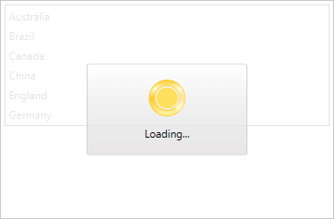

# Getting Started with {{ site.framework_name }} BusyIndicator

This tutorial will walk you through the creation of a sample application that contains __RadBusyIndicator__. 

> The __RadBusyIndicator__ is displayed on the UI thread. If this thread is blocked, the control will not be shown. It is meant to indicate to the user that there is a long running background task/process.

## Adding Telerik Assemblies Using NuGet

To use __RadBusyIndicator__ when working with NuGet packages, install the `Telerik.Windows.Controls.for.Wpf.Xaml` package. The [package name may vary]() slightly based on the Telerik dlls set - [Xaml or NoXaml]()

Read more about NuGet installation in the [Installing UI for WPF from NuGet Package]() article.

>tip With the 2025 Q1 release, the Telerik UI for WPF has a new licensing mechanism. You can learn more about it [here]().

## Adding Assembly References Manually

If you are not using NuGet packages, you can add a reference to the following assemblies:

* __Telerik.Licensing.Runtime__
* __Telerik.Windows.Controls__

## Adding RadBusyIndicator to the Project

Make sure the required assembly reference is added to the project before you proceed with adding __RadBusyIndicator__ to your project.

You can add __RadBusyIndicator__ manually by writing the XAML code in __Example 1__. You can also add the control by dragging it from the Visual Studio Toolbox and dropping it over the XAML view.

__Example 1: Adding RadBusyIndicator in XAML__

```XAML
	<telerik:RadBusyIndicator x:Name="radBusyIndicator">
	    <!--Some Content-->
	</telerik:RadBusyIndicator>
```

In order to use __RadBusyIndicator__ in XAML, you have to add the namespace declaration shown in __Example 2__.

__Example 2: Declaring Telerik Namespace__

```XAML
    xmlns:telerik="http://schemas.telerik.com/2008/xaml/presentation"
```

When you are using __RadBusyIndicator__, you always have to set its __Content__ property. This will be the content on top of which you want to visualize __RadBusyIndicator__. __Example 3__ demonstrates __RadBusyIndicator__ with some custom __Content__ placed inside it:

__Example 3: Adding Content__

```XAML
     <telerik:RadBusyIndicator x:Name="radBusyIndicator">
        <Grid>
            <telerik:RadListBox>
                <telerik:RadListBoxItem Content="Australia" />
                <telerik:RadListBoxItem Content="Brazil" />
                <telerik:RadListBoxItem Content="Canada" />
                <telerik:RadListBoxItem Content="China" />
                <telerik:RadListBoxItem Content="England" />
                <telerik:RadListBoxItem Content="Germany" />
            </telerik:RadListBox>
        </Grid>
    </telerik:RadBusyIndicator>
```

## Enabling RadBusyIndicator

To activate __RadBusyIndicator__ you have to set its __IsBusy__ boolean property to __True__. It is a Dependency property that you can data bind in any way that suits your custom logic.

>__RadBusyIndicator__ will be visible only when the __IsBusy__ property is set to __True__.

__Example 4__ presents __RadBusyIndicator__ with its __IsBusy__ property set to __True__:

__Example 4: Adding Content__

```XAML
     <telerik:RadBusyIndicator x:Name="radBusyIndicator" IsBusy="True">
        <Grid>
            <telerik:RadListBox>
                <telerik:RadListBox>
                    <telerik:RadListBoxItem Content="Australia" />
                    <telerik:RadListBoxItem Content="Brazil" />
                    <telerik:RadListBoxItem Content="Canada" />
                    <telerik:RadListBoxItem Content="China" />
                    <telerik:RadListBoxItem Content="England" />
                    <telerik:RadListBoxItem Content="Germany" />
                </telerik:RadListBox>
            </telerik:RadListBox>
        </Grid>
    </telerik:RadBusyIndicator>
```

If you run the application you will see __RadBusyIndicator__ placed on top of its __Content__.

#### __Figure1: This figure is generated by the code in Example 4 RadBusyIndicator__



## Progress Determination, Custom BusyContent, Delaying of Display

### Progress Determination

__RadBusyIndicator__  supports two main modes of execution that could be used to visualize the progress of the control - determined and indetermined. If you need a determined __RadBusyIndicator__ you have to set the value of the __IsIndeterminated__ property to __False__. Please, check [this]() article for some information concerning the progress determination of __RadBusyIndicator__.

### Custom Busy Content

__RadBusyIndicator__ exposes a __BusyContentTemplate__ property of type DataTemplate. Through this template you can customize what is shown in RadBusyIndicator's content while the indicator is active. For more information, look at [this article]().

### Delaying of display

You can notify the users about an ongoing process with a specific delay when __RadBusyIndicator__ is used. By changing the __DisplayAfter__ property to a certain __TimeSpan__, __RadBusyIndicator__ will be shown after the corresponding amount of time elapses - the default value of this delay is 100 milliseconds. For detailed information about using a delay with __RadBusyIndicator__, look at [this article]().

## Setting a Theme

The controls from our suite support different themes. You can see how to apply a theme different than the default one in the [Setting a Theme]() help article.

>important Changing the theme using implicit styles will affect all controls that have styles defined in the merged resource dictionaries. This is applicable only for the controls in the scope in which the resources are merged. 

To change the theme, you can follow the steps below:

* Choose between the themes and add reference to the corresponding theme assembly (ex: **Telerik.Windows.Themes.Fluent.dll**). You can see the different themes applied in the **Theming** examples from our [WPF Controls Examples](https://demos.telerik.com/wpf/)[Silverlight Controls Examples](https://demos.telerik.com/silverlight/#BusyIndicator/Theming) application.

* Merge the ResourceDictionaries with the namespace required for the controls that you are using from the theme assembly. For the __RadBreadcrumb__, you will need to merge the following resources:

	* __Telerik.Windows.Controls__

__Example 5__ demonstrates how to merge the ResourceDictionaries so that they are applied globally for the entire application.

__Example 5: Merge the ResourceDictionaries__  
```XAML
	<Application.Resources>
		<ResourceDictionary>
			<ResourceDictionary.MergedDictionaries>
				<ResourceDictionary Source="/Telerik.Windows.Themes.Fluent;component/Themes/System.Windows.xaml"/>
				<ResourceDictionary Source="/Telerik.Windows.Themes.Fluent;component/Themes/Telerik.Windows.Controls.xaml"/>
			</ResourceDictionary.MergedDictionaries>
		</ResourceDictionary>
	</Application.Resources>
```

>Alternatively, you can use the theme of the control via the [StyleManager](https://docs.telerik.com/devtools/wpf/styling-and-appearance/stylemanager/common-styling-apperance-setting-theme-wpf)[StyleManager](https://docs.telerik.com/devtools/silverlight/styling-and-appearance/stylemanager/common-styling-apperance-setting-theme).

__Figure 1__ shows a __RadBusyIndicator__ with the **Fluent** theme applied.
	
#### __Figure 1: RadBusyIndicator with the Fluent theme__



## Telerik UI for WPF Learning Resources

* [Telerik UI for WPF BusyIndicator Component](https://www.telerik.com/products/wpf/busyindicator.aspx)
* [Getting Started with Telerik UI for WPF Components]()
* [Telerik UI for WPF Installation]()
* [Telerik UI for WPF and WinForms Integration]()
* [Telerik UI for WPF Visual Studio Templates]()
* [Setting a Theme with Telerik UI for WPF]()
* [Telerik UI for WPF Virtual Classroom (Training Courses for Registered Users)](https://learn.telerik.com/learn/course/external/view/elearning/16/telerik-ui-for-wpf) 
* [Telerik UI for WPF License Agreement](https://www.telerik.com/purchase/license-agreement/wpf-dlw-s)


## See Also

 * [Overview]()

 * [Visual Structure]()

 * [Styles and Templates - Overview]()

 * [Integrate with services and a RadWindow]()
