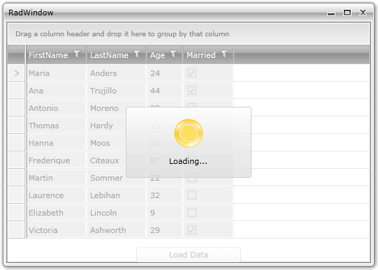

# Integrate with services and a RadWindow

This tutorial will show you how to apply a __RadBusyIndicator__ while a long distance calls are being in progress.        

One way to achieve this is to make the time consuming service calls in a separate thread. To accomplish this you can use the __BackgroundWorker__ class.

This topic will create a __RadWindow__ control containing a __RadGridView__ and a __Button__. Pressing the button will reproduce a service call which will retrieve some data. Later when the data is available it will be loaded into the __RadGridView__ and while the call is in progress the __RadBusyIndicator__ will be shown to indicate the ongoing process.        

Here is a snapshot of the final result:



* The first thing you have to do is to declare the __RadWindow__ and set its content to be the __RadBusyIndicator__ content control as long as you want to show the indicator over the __RadWindow__ control.

>tip We will create __RadWindow__ as a user control, the approach is explained in details [here]().

__RadWindow declaration__

```XAML
	<telerik:RadWindow x:Class="RadWindow1"
			xmlns="http://schemas.microsoft.com/winfx/2006/xaml/presentation"
			xmlns:x="http://schemas.microsoft.com/winfx/2006/xaml"
			xmlns:telerik="http://schemas.telerik.com/2008/xaml/presentation"
			Header="RadWindow1" Height="500" Width="400">
	    <Grid>
		<telerik:RadBusyIndicator x:Name="radBusyIndicator">
			<Grid>
				<telerik:RadGridView x:Name="radGridView"
	                                         AutoGenerateColumns="True" />
				<Button Content="Load Data"
	                            VerticalAlignment="Bottom"
	                            Click="LoadDataButton_Click"
	                            Width="150" />
			</Grid>
		</telerik:RadBusyIndicator>
	    </Grid>
	</telerik:RadWindow>
```

Here is the sample data that is going to be retrieved:

__Retrieved sample data__

```C#
	public class Employee
	{
	    public string FirstName
	    {
	        get;
	        set;
	    }
	    public string LastName
	    {
	        get;
	        set;
	    }
	    public int Age
	    {
	        get;
	        set;
	    }
	    public bool Married
	    {
	        get;
	        set;
	    }
	}
```

__EmployeeService class__

```C#
	public class EmployeeService
	{
	    public static ObservableCollection<Employee> GetEmployees()
	    {
	        ObservableCollection<Employee> employees = new ObservableCollection<Employee>();
	        Employee employee = new Employee();
	        employee.FirstName = "Maria";
	        employee.LastName = "Anders";
	        employee.Married = true;
	        employee.Age = 24;
	        employees.Add( employee );        //...
	        Thread.Sleep( employees.Count * 100 );
	        return employees;
	    }
	}
```

__Retrieved sample data__

```VB
	Public Class Employee
	 Public Property FirstName() As String
	  Get
	   Return m_FirstName
	  End Get
	  Set
	   m_FirstName = Value
	  End Set
	 End Property
	 Private m_FirstName As String
	 Public Property LastName() As String
	  Get
	   Return m_LastName
	  End Get
	  Set
	   m_LastName = Value
	  End Set
	 End Property
	 Private m_LastName As String
	 Public Property Age() As Integer
	  Get
	   Return m_Age
	  End Get
	  Set
	   m_Age = Value
	  End Set
	 End Property
	 Private m_Age As Integer
	 Public Property Married() As Boolean
	  Get
	   Return m_Married
	  End Get
	  Set
	   m_Married = Value
	  End Set
	 End Property
	 Private m_Married As Boolean
	End Class
```

__EmployeeService class__

```VB
	Public Class EmployeeService
	 Public Shared Function GetEmployees() As ObservableCollection(Of Employee)
	  Dim employees As New ObservableCollection(Of Employee)()
	  Dim employee As New Employee()
	  employee.FirstName = "Maria"
	  employee.LastName = "Anders"
	  employee.Married = True
	  employee.Age = 24
	  employees.Add(employee)
	  '...
	  Thread.Sleep(employees.Count * 100)
	  Return employees
	 End Function
	End Class
```

* In code you can use the __BackgroundWorker__ to make your service calls in a different thread:

	* Handle the __DoWork__ event to make the time consuming call.

	* Handle the __RunWorkerCompleted__ event to disable the __RadBusyIndicator__ and show the result.

>In order to use the BackgroundWorker you will have to add the following using/import in your code:
>* System.ComponentModel

__BackgroundWorker usage__

```C#
	public partial class RadWindow1
	{      
		private BackgroundWorker worker = new BackgroundWorker();
		public RadBusyIndicatorExample()
		{
			InitializeComponent();
			this.radWindow.Show();
			worker.DoWork += this.WorkerDoWork;
			worker.RunWorkerCompleted += WorkerRunWorkerCompleted;            
		}
		private void WorkerDoWork( object sender, DoWorkEventArgs e )
		{
			e.Result = EmployeeService.GetEmployees();            
		}
		private void UpdateGridDataSource( ObservableCollection<Employee> employees )
		{
			this.radGridView.ItemsSource = employees;
			this.radBusyIndicator.IsBusy = false;
		}
	
		void WorkerRunWorkerCompleted( object sender, RunWorkerCompletedEventArgs e )
		{
			Dispatcher.BeginInvoke( new Action<ObservableCollection<Employee>>( this.UpdateGridDataSource ), e.Result );
		}
	
		private void LoadDataButton_Click( object sender, RoutedEventArgs e )
		{
			if ( !worker.IsBusy )
			{
				this.radBusyIndicator.IsBusy = true;
				worker.RunWorkerAsync();
			}
		}
	}
```

__BackgroundWorker usage__

```VB
	Public Class RadWindow1
		Private worker As New BackgroundWorker()
	
		Public Sub New()
			' This call is required by the designer.
			InitializeComponent()
	
			AddHandler worker.DoWork, AddressOf WorkerDoWork
			AddHandler worker.RunWorkerCompleted, AddressOf WorkerRunWorkerCompleted
		
	
		End Sub
	
		Private Sub WorkerDoWork(sender As Object, e As DoWorkEventArgs)
			e.Result = EmployeeService.GetEmployees()
		End Sub
	
		Private Sub UpdateGridDataSource(employees As ObservableCollection(Of Employee))
			Me.radGridView.ItemsSource = employees
			Me.radBusyIndicator.IsBusy = False
		End Sub
	
		Private Sub WorkerRunWorkerCompleted(sender As Object, e As RunWorkerCompletedEventArgs)
			Dispatcher.BeginInvoke(New Action(Of ObservableCollection(Of Employee))(AddressOf UpdateGridDataSource), e.Result)
	
		End Sub
		Private Sub LoadDataButton_Click(sender As Object, e As RoutedEventArgs)
			If Not worker.IsBusy Then
				Me.radBusyIndicator.IsBusy = True
				worker.RunWorkerAsync()
			End If
		End Sub
	End Class
```

* Then just open the RadWindow:

__Open RadWindow__

```C#
	var radWindow = new RadWindow1();
	radWindow.Show();
```

__Open RadWindow__

```VB
	Dim radWindow As RadWindow1 = New RadWindow1()
	radWindow.Show()
```

Here is the final result:


## See Also

 * [Progress Determination]()

 * [Report Progress Value]()

 * [Custom Busy Content]()
