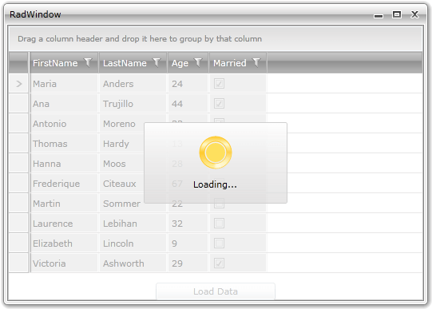

# Integrate with services and a RadWindow

This tutorial will show you how to apply a __RadBusyIndicator__ while a long distance calls are being in progress.        

One way to achieve this is to make the time consuming service calls in a separate thread. To accomplish this you can use the __BackgroundWorker__ class.

This topic will create a __RadWindow__ control containing a __RadGridView__ and a __Button__. Pressing the button will reproduce a service call which will retrieve some data. Later when the data is available it will be loaded into the __RadGridView__ and while the call is in progress the __RadBusyIndicator__ will be shown to indicate the ongoing process.        

Here is a snapshot of the final result:

* The first thing you have to do is to declare the __RadWindow__ and set its content to be the __RadBusyIndicator__ content control as long as you want to show the indicator over the __RadWindow__ control.

>tip We will create __RadWindow__ as a user control, the approach is explained in details [here]().

__RadWindow declaration__

<snippet id='radbusyindicator-how-to-integrate-with-services-and-radwindow-radwindow_declaration-xaml' />

Here is the sample data that is going to be retrieved:

__Retrieved sample data__

<snippet id='radbusyindicator-how-to-integrate-with-services-and-radwindow-retrieved_sample_data-cs' />

<snippet id='radbusyindicator-how-to-integrate-with-services-and-radwindow-retrieved_sample_data-vb' />

__EmployeeService class__

<snippet id='radbusyindicator-how-to-integrate-with-services-and-radwindow-employeeservice_class-cs' />

<snippet id='radbusyindicator-how-to-integrate-with-services-and-radwindow-employeeservice_class-vb' />

__Retrieved sample data__

__EmployeeService class__

* In code you can use the __BackgroundWorker__ to make your service calls in a different thread:

	* Handle the __DoWork__ event to make the time consuming call.

	* Handle the __RunWorkerCompleted__ event to disable the __RadBusyIndicator__ and show the result.

>In order to use the BackgroundWorker you will have to add the following using/import in your code:
>* System.ComponentModel

__BackgroundWorker usage__

<snippet id='radbusyindicator-how-to-integrate-with-services-and-radwindow-backgroundworker_usage-cs' />

<snippet id='radbusyindicator-how-to-integrate-with-services-and-radwindow-backgroundworker_usage-vb' />

__BackgroundWorker usage__

* Then just open the RadWindow:

__Open RadWindow__

<snippet id='radbusyindicator-how-to-integrate-with-services-and-radwindow-open_radwindow-cs' />

<snippet id='radbusyindicator-how-to-integrate-with-services-and-radwindow-open_radwindow-vb' />

__Open RadWindow__

Here is the final result:

## See Also

 * [Progress Determination]()

 * [Report Progress Value]()

 * [Custom Busy Content]()
