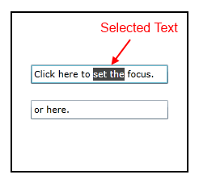
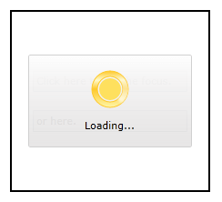
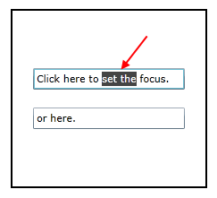

# Restore the focus

This topic will show you how to handle a common scenario where you have a __RadBusyIndicator__ control having some content and you need to ensure that when the __RadBusyIndicator__ is no longer visible, the focus will be returned to a specific control in its content.

## Restore the Focus on Specific Control

The following example will assume that you have a __RadBusyIndicator__ control containing a __TextBox__ and a toggle button which will trigger the busy state of the __RadBusyIndicator__. Whenever the  __RadBusyIndicator__ disappears the focus will be brought back to the __TextBox__ control.

To achieve this behavior you will have to bring the focus back to the desired control by yourself. One way to do it is to track down when the __RadBusyIndicator__ is enabled and manually set the focus.

You do this by using the __IsBusyIndicationVisible__ boolean property. Its value will be equal to __True__ whenever the __RadBusyIndicator__ is enabled and the busy content including the progress bar, is visualized. You might try to use the __IsBusy__ property but it will not bring you to the desired solution because the __IsBusyIndicationVisible__ property is updated after the __IsBusy__ property.

Here is an example of this additional behavior that you will need:

__Declaring the AttachedProperty__

<snippet id='radbusyindicator-how-to-restore-the-focus-declaring_the_attachedproperty-cs' />

In the definition of the content element you will have to include the new behavior.

__Define the new behavior inside the content__

<snippet id='radbusyindicator-how-to-restore-the-focus-define_the_new_behavior_inside_the_content-xaml' />

## Restoring the Focus to the Last Focused Control

In order to restore the focus on a Control that was focused before the __RadBusyIndicator__ control was enabled all you need to do is save the focused Control and then reset the focus to it when the BusyIndicator is disabled.
        

The next example shows how to save the last focused Control and reset its focus as soon as the BusyIndicator is disabled. For example purposes the RadBusyIndicator will be enabled/disabled with the use of a DispatcherTimer that will show and hide the control every five seconds for five seconds.        

1. First we will need to create a sample layout and set the __RadBusyIndicator__:            

	__Sample layout declaration__

<snippet id='radbusyindicator-how-to-restore-the-focus-define_the_new_behavior_inside_the_content-xaml' />

2. Next we will need to create a property for the focused control to be save to in the code behind or the ViewModel:            

	__Property declaration__

<snippet id='radbusyindicator-how-to-restore-the-focus-define_the_new_behavior_inside_the_content-cs' />

3. Create an set the DispatcherTimer that will enable and disable the BusyIndicator control:

	__Set the DispatcherTimer__

<snippet id='radbusyindicator-how-to-restore-the-focus-define_the_new_behavior_inside_the_content-cs' />

>tip Find a runnable project of the previous example in the [WPF Samples GitHub repository](https://github.com/telerik/xaml-sdk/tree/master/BusyIndicator/RestoreFocus).

The next screenshots show the final result:        

* Before the RadBusyIndicator is shown: 

* When the RadBusyIndicator is shown:

* After the RadBusyIndicator is hidden (the focused TextBox is focused):

## See Also

 * [Delayed Display]()

 * [Modify the default placement]()

 * [Integrate with services and a RadWindow]()
