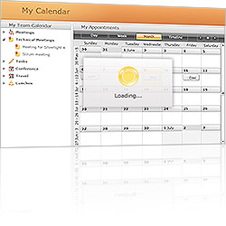

# Overview

## 



				 
			

				 
			

Thank you for choosing __RadBusyIndicator__!

         
      

Telerik __RadBusyIndicator__ enables you to display a notification whenever a longer-running process is being handled by the application. This makes the UI more informative and the user experience smoother.

This is a list with short descriptions of the top-of-the-line features of Telerik's __RadBusyIndicator__ control:

* __Progress Determination__ - The Telerik Silverlight __BusyIndicator__ control can display a visual indication for either determinate or indeterminate processes. [Read more]()

* __Progress Detection__ - With the __BusyIndicator’s__ rich API model you can easily detect the progress and present the progress value. [Read more]()

* __Styling and Appearance__ - Telerik Silverlight __BusyIndicator__ can be fully customized using Expression Blend. There are also several pre-defined themes that can be used to style the control. [Read more]()

* __Delayed Start__ - You can set the preferred delay timespan, after which the __BusyIndicator__ will start. [Read more]()

# See Also

 * [Visual Structure]()

 * [Getting Started]()

 * [Styles and Templates - Overview]()
