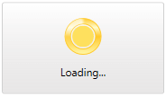

# Overview








Thank you for choosing __RadBusyIndicator__!

__RadBusyIndicator__ enables you to display a notification whenever a longer-running process is being handled by the application. This makes the UI more informative and the user experience smoother.

## Key Features

This is a list with short descriptions of the top-of-the-line features of the __RadBusyIndicator__ control:

* __Progress Determination__: RadBusyIndicator can display a visual indication for either determinate or indeterminate processes. Read more about this in the [Progress Determination]() article.

* __Progress Detection__: The control provides a rich API model which can be used to easily detect the progress and present the progress value. Read more about this in the [Report Progress Value]() article.

* __Delayed Start__: You can set the preferred delay timespan, after which the __BusyIndicator__ will start. Read more about this in the [Delayed Display]() article.

* __Theming__: As any other control from the UI for {{ site.framework_name }} suite, RadBusyIndicator comes with different themes. Read more about this in the [Styling and Appearance]() section of the documentation. 

>tip Get started with the control with its [Getting Started]() help article that shows how to use it in a basic scenario.

> Check out the online demo at [demos.telerik.com](https://demos.telerik.com/silverlight/#BusyIndicator/FirstLook)[demos.telerik.com](https://demos.telerik.com/wpf/)

## See Also
 * [Visual Structure]()
 * [Getting Started]()
 * [Styles and Templates - Overview]()
