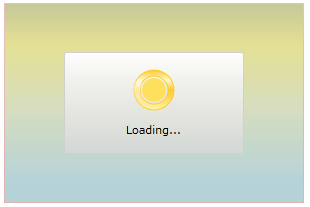

# Setting the OverlayStyle

>tipBefore reading this topic, you might find it useful to get familiar with the [Template Structure of the RadBusyIndicator]() control.

The __RadBusyIndicator__ exposes a __OverlayStyle__ property which allows you to apply a style to the __Rectangle__ element overlaying the __RadBusyIndicator's__ content while the indicator is active. 

To do this, first you have to define your __RadBusyIndicator__ control:

__Defining RadBusyIndicator__

```XAML
	<Grid x:Name="LayoutRoot"
	      Background="White">
	    <telerik:RadBusyIndicator OverlayStyle="{StaticResource OverlayStyle}"
	                              IsBusy="True"/>
	</Grid>
```

In the __RadBusyIndicator's__ definition you have indicated the __OverlayStyle__, that's why you have to define this style in the resources of your __UserControl__. Here is an example:

__OverlayStyle declaration__

```XAML
	<UserControl.Resources>
	    <Style x:Key="OverlayStyle"
	           TargetType="Rectangle">
	        <Setter Property="Stroke"
	                Value="#FFDA8282" />
	        <Setter Property="Fill">
	            <Setter.Value>
	                <LinearGradientBrush EndPoint="0.5,1"
	                                     MappingMode="RelativeToBoundingBox"
	                                     StartPoint="0.5,0">
	                    <GradientStop Color="#FF6BBDD2"
	                                  Offset="0" />
	                    <GradientStop Color="#FFD2CC34"
	                                  Offset="0.209" />
	                    <GradientStop Color="#FFC2CE8E"
	                                  Offset="0.512" />
	                    <GradientStop Color="#FF86C0CE"
	                                  Offset="0.897" />
	                    <GradientStop Color="#FF8E9334"
	                                  Offset="0" />
	                </LinearGradientBrush>
	            </Setter.Value>
	        </Setter>
	        <Setter Property="Opacity"
	                Value="0.5" />
	    </Style>
	</UserControl.Resources>
```

>Notice that in the __OverlayStyle__ the __Opacity__ property is also specified. As a result if the __RadBusyIndicator__ had any content, it would still be visible while the indicator was active.

>tipYou can remove the __RadBusyIndicator__ busy content's background by setting the control's __Background__ property to __Transparent__.

__Remove the BusyContent's Background__

```XAML
	<telerik:RadBusyIndicator Background="Transparent"/>
```

Here is the result:



## See Also

 * [Styles and Templates - Overview]()

 * [Template Structure]()

 * [Styling the RadBusyIndicator]()

 * [Styling the RadProgressBar]()
