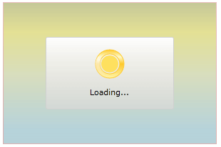

# Setting the OverlayStyle

>tip Before reading this topic, you might find it useful to get familiar with the [Template Structure of the RadBusyIndicator]() control.

The __RadBusyIndicator__ exposes a __OverlayStyle__ property which allows you to apply a style to the __Rectangle__ element overlaying the __RadBusyIndicator's__ content while the indicator is active. 

To do this, first you have to define your __RadBusyIndicator__ control:

__Defining RadBusyIndicator__

<snippet id='radbusyindicator-styles-and-templates-setting-the-overlay-style-defining_radbusyindicator-xaml' />

In the __RadBusyIndicator's__ definition you have indicated the __OverlayStyle__, that's why you have to define this style in the resources of your __UserControl__. Here is an example:

__OverlayStyle declaration__

<snippet id='radbusyindicator-styles-and-templates-setting-the-overlay-style-overlaystyle_declaration-xaml' />

>Notice that in the __OverlayStyle__ the __Opacity__ property is also specified. As a result if the __RadBusyIndicator__ had any content, it would still be visible while the indicator was active.

>tip You can remove the __RadBusyIndicator__ busy content's background by setting the control's __Background__ property to __Transparent__.

__Remove the BusyContent's Background__

<snippet id='radbusyindicator-styles-and-templates-setting-the-overlay-style-remove_the_busycontent_s_background-xaml' />

Here is the result:

## See Also

 * [Styles and Templates - Overview]()

 * [Template Structure]()

 * [Styling the RadBusyIndicator]()

 * [Styling the RadProgressBar]()
