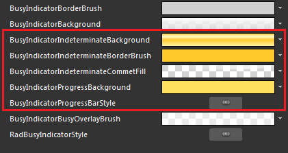
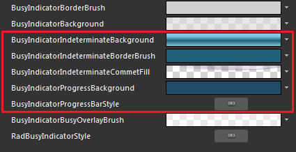
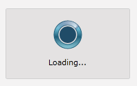
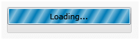

# Styling the RadProgressBar

>tip Before reading this topic, you might find it useful to get familiar with the [Template Structure of the RadBusyIndicator]() control.

The __RadBusyIndicator__ exposes a __ProgressBarStyle__ property which allows you to modify the control's progress bar default appearance.

You have two options:

* [To copy the default style of the control and modify it](#modify-the-default-style)

* [To create an empty style and set it up on your own](#create-a-custom-progressbar-style)

## Modify the default Style 

To copy the default styles, load your project in Expression Blend and open the User Control that holds the __RadBusyIndicator__. In the 'Objects and Timeline' pane select the __RadBusyIndicator__ you want to style. From the menu choose *Object -> Edit Style -> Edit a Copy*. You will be prompted for the name of the style and where to be placed.

>tip If you choose to define the style in Application, it would be available for the entire application. This allows you to define a style only once and then reuse it where needed.

After clicking 'OK', Expression Blend will generate the default style of the __RadBusyIndicator__ control in the __Resources__ section of your User Control. The properties available for the style will be loaded in the 'Properties' pane and you will be able to modify their default values. You can also edit the generated XAML in the XAML View or in Visual Studio. 

Here are the generated resources related to the __RadProgressBar__:



* __BusyIndicatorProgressBarStyle__ - represents the default style applied to the __RadProgressBar__ control.

* __BusyIndicatorIndeterminateBackground__ - represents the brush applied to the indicator's outer donut.

* __BusyIndicatorIndeterminateBorderBrush__ - represents the brush applied to the indicator's outer donut's border.

* __BusyIndicatorIndeterminateCommetFill__ - represents the brush applied to the rolling comet.

* __BusyIndicatorProgressBackground__ - represents the brush applied to the inner circle of the __RadBusyIndicator__ control.

Here is an example of the above resources modified:



Here is the result:



## Create a custom ProgressBar Style

>tip Read more about the __RadProgressBar__ [here]().

>When you choose to create a custom __ProgressBarStyle__ you will lose the __RadBusyIndicator's__ default template.

Here is a simple example of creating a custom style for your __RadProgressBar__:

__Custom RadProgressBar Style__

```XAML
	<Style x:Key="CustomProgressBarStyle" TargetType="telerik:RadProgressBar">
	    <Setter Property="Foreground" Value="#FF027DB8"/>
	    <Setter Property="Background" Value="#FFD2D5D8"/>
	    <Setter Property="BorderThickness" Value="1"/>
	    <Setter Property="Maximum" Value="100"/>
	    <Setter Property="IsTabStop" Value="False"/>
	    <Setter Property="BorderBrush">
	        <Setter.Value>
	            <LinearGradientBrush EndPoint=".5,1" StartPoint=".5,0">
	                <GradientStop Color="#FFAEB7BF" Offset="0"/>
	                <GradientStop Color="#FF919EA7" Offset="0.35"/>
	                <GradientStop Color="#FF7A8A99" Offset="0.35"/>
	                <GradientStop Color="#FF647480" Offset="1"/>
	            </LinearGradientBrush>
	        </Setter.Value>
	    </Setter>
	    <Setter Property="Margin" Value="0,0,0,-25"/>
	</Style>
```

Use the __ProgressBarStyle__ property to apply the style to the __RadBusyIndicator__:

__Setting the ProgressBarStyle__

```XAML
	<telerik:RadBusyIndicator ProgressBarStyle="{StaticResource CustomProgressBarStyle}" />
```

And the result is:



## See Also

 * [Styles and Templates - Overview]()

 * [Template Structure]()

 * [Styling the RadBusyIndicator]()

 * [Setting the OverlayStyle]()
