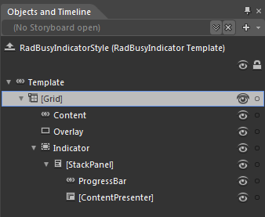
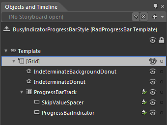

# Template Structure

Like most controls, the __RadBusyIndicator__ also allows you to template it in order to change the control from the inside. Except for templating the whole control, you can also template only parts of it. This topic will make you familiar with the template structures of the:      

* [RadBusyIndicator](#radbusyindicator)

* [RadProgressBar](#radprogressbar)

>For more information about templating and how to modify the default templates of the controls from the UI for SilverlightWPF suite read [the common topics](http://www.telerik.com/help/silverlight/common-styling-appearance-edit-control-templates-blend.html) on this matter.
        

## RadBusyIndicator

* __[Grid]__

	* __Content__ - is of type __ContentControl__ and hosts the __RadBusyIndicator's__ content.

	* __Overlay__ - is of type __Rectangle__ and represents the rectangle overlaying the content while the __RadBusyIndicator__ is active.

	* __Indicator__ - hosts the indicator control and is of type __Border__.

		* __[StackPanel]__ - represents the __StackPanel__ containing the indicator's elements:

			* __ProgressBar__ - represents the __RadProgressBar__ visible while the __RadBusyIndicator__ is active.

			* __[ContentPresenter]__ - represents the content  shown underneath the __RadProgressBar__ and is of type __ContentPresenter__.

## RadProgressBar

* __[Grid]__ - represents the host container for the __RadProgressBar__ control.

	* __IndeterminateBackgroundDonut__ - represents the outer background donut visible while the __RadProgressBar__ is active and is of type __Path__.

	* __IndeterminateDonut__ - represents the rolling background __Path__ visible while the __RadProgressBar__ is active.

	* __ProgressBarTrack__ - represents a specific __PART__ element of type __Grid__ hosting the indicator's content.

		* __SkipValueSpacer__ - is of type __Rectangle__ and is also a __PART__ element.

		* __ProgressBarIndicator__- is a __PART__ element of type __Rectangle__ and hosts the innermost circle of the __RadProgressBar's__ indicator.
		
## See Also

 * [Styles and Templates - Overview]()

 * [Visual Structure]()

 * [Styling the RadBusyIndicator]()

 * [Styling the RadProgressBar]()

 * [Setting the OverlayStyle]()

 * [Custom Busy Content]()

 * [Modify the default placement]()
