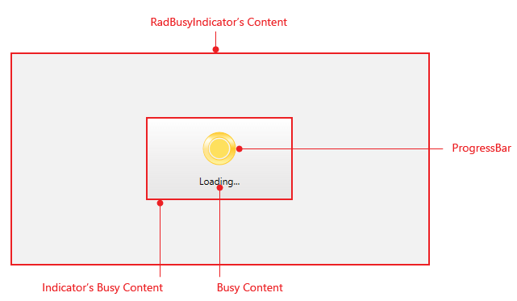

# Visual Structure

__RadBusyIndicator__ is a content control which gives you the ability to notify the user that there is an ongoing process in the application. The most important part of its visual representation is the __ProgressBar__ and the busy content which purpose is to further inform the user about the current state of the ongoing process.

* __RadBusyIndicator's  Content__ - is the controls content.

* __Indicator's Busy Content__ - hosts __RadBusyIndicator's__  busy content visible while it is active.

* __Busy Content__ - is the __ContentPresenter__ giving the user additional feedback of the current progress.

* __ProgressBar__ - is the __RadProgressBar__ control representing the ongoing process.  

# See Also

 * [Overview]()

 * [Getting Started]()

 * [Template Structure]()
