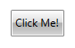
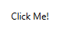
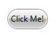

# Button

The __RadButton__ control inherits from the __Button__ control and implements the __ICommandSource__ interface. Because of the inheritance it has all of the features that the standard __Button__ control has. Moreover, the __ICommandSource__ implementation allows you to attach commands to the button, which will get executed when it gets clicked.	  

To learn more about the members of the __RadButton__ class, you can read [here](http://www.telerik.com/help/silverlight/allmembers_t_telerik_windows_controls_radbutton.html)[here](http://www.telerik.com/help/wpf/allmembers_t_telerik_windows_controls_radbutton.html).

To learn how to use it with commands you should read the [Commands]() topic.	  

## Instantiating RadButton

You can instantiate your __RadButton__ in both XAML and code. Here is an example:		

> The __RadButton__ control is located in the __Telerik.Windows.Controls.dll__ and in order to use it in your project you have to add a reference to the assembly.  You can find more info [here](http://www.telerik.com/help/wpf/installation-installing-controls-dependencies-wpf.html). You can find more info [here](http://www.telerik.com/help/silverlight/installation-installing-controls-dependencies.html). <br/> Then in XAML you have to declare the namespace: `xmlns:telerik="http://schemas.telerik.com/2008/xaml/presentation"`

__Example 1: Defining a button in XAML__  
```XAML
	<telerik:RadButton Content="Click Me!" />
```

__Example 2: Defining a button in code__  
```C#
	RadButton radButton = new RadButton(){Content = "Click Me!"};
```
```VB.NET
	Dim radButton As New RadButton() With { _
	    .Content = "Click Me!" _
	}
```

#### __Figure 1: The created button__


## Handling the Button Click

If you want to implement custom logic to be executed when the button is clicked, you can either:

* handle the __Click__ event.		  

or

* use __Commands__.		  

>tip You can see how to use commands in the [Commands]() article.
		
Here is an example of handling the __Click__ event of a button.		

__Example 3: Subscribing to the Click event__  
```XAML
	<telerik:RadButton Content="Click Me!" Click="RadButton_Click" />
```

__Example 4: Defining a Click event handler__  
```C#
	private void RadButton_Click(object sender, RoutedEventArgs e)
	{
	    //implement your logic here
	}
```
```VB.NET
	Private Sub RadButton_Click(sender As Object, e As RoutedEventArgs)
	    'implement your logic here'
	End Sub
```

## Customizing the RadButton

* __IsBackgroundVisible__ - this property is of type bool and it controls the visibility of the background and the border of the __RadButton__ control in normal state	
	#### __Figure 2: A button with a hidden background__
		  

* __CornerRadius__ - this property is of type __CornerRadius__ and it controls the __CornerRadius__ of the __RadButton__ control	
	#### __Figure 3: A button with its CornerRadius set to 15__
		  

## See Also
 * [DropDown Button]()
 * [Commands]()
 * [Toggle Button]()