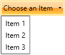

# DropDown Button

The `RadDropDownButton` control derives from __[RadButton]()__. Therefore it has all of the features that the `RadButton` control provides.

## Defining RadDropDownButton

You can instantiate your `RadDropDownButton` in both XAML and code as shown in the following examples.

__Defining a button in XAML__  
```XAML
	<telerik:RadDropDownButton Content="Click Me!" />
```

__Defining a button in code__  
```C#
	RadDropDownButton radDropDownButton = new RadDropDownButton() { Content = "Click Me!" };
```
```VB.NET
	Dim radDropDownButton As New RadDropDownButton() With { _
	    .Content = "Click Me!" _
	}
```

__Drop-down button__


## Adding DropDown Content

In order to add content to the drop-down area of the RadDropDownButton you have to use its `DropDownContent` property. It is of type `object` so you can add any control as content of the drop-down. The next example shows how to add a `ListBox` control in the drop-down content of the button.

__Adding dropdown content to the button__ 
```XAML
	<telerik:RadDropDownButton AutoOpenDelay="0:0:0.0"
	                           Content="Choose an Item">
	    <telerik:RadDropDownButton.DropDownContent>
	        <ListBox>
	            <ListBoxItem Content="Item 1" />
	            <ListBoxItem Content="Item 2" />
	            <ListBoxItem Content="Item 3" />
	        </ListBox>
	    </telerik:RadDropDownButton.DropDownContent>
	</telerik:RadDropDownButton>
```

__Drop-down content__



>tip If you want to display dynamic content inside the drop-down area, you can use the `DropDownContentTemplate` and the `DropDownContentTemplateSelector` properties. You can read about [TemplateSelectors](http://msdn.microsoft.com/en-us/library/system.windows.controls.datatemplateselector%28v=vs.110%29.aspx) in MSDN.

## Auto Opening

You can allow the RadDropDownButton to automatically display its `DropDownContent`, when the mouse hovers over it. This behaviour is controlled via the `AutoOpenDelay` property of the RadDropDownButton, that specifies the time, after which you want to display the RadDropDownButton.DropDownContent. In order to disable the auto opening feature of the control, you can set the AutoOpenDelay to `0`.

__Setting the AutoOpenDelay__ 
```XAML
	<telerik:RadDropDownButton AutoOpenDelay="0:0:0.5" />
```

## Customizing the RadDropDownButton

You can easily customize the `RadDropDownButton` by using the following properties:

* `CloseOnEscape`&mdash;Specifies whether the drop-down should be closed when the `ESC` key gets pressed. The default value is `True`.		  

* `IsOpen`&mdash;Specifies whether the DropDownContent of the button is opened.		  

* `KeepOpen`&mdash;Specifies whether the DropDownContent should remain open while clicking outside it.		  

* `PopupPlacementTarget`&mdash;Specifies the placement of the popup element that displays the drop-down content.

* `DropDownButtonPosition`&mdash;Specifies the position of the drop-down arrow. The possible values are `Bottom`, `Left`, `Right` (default), `Top`.		  

* `DropDownWidth`&mdash;specifies the width of the drop-down area.

* `DropDownHeight`&mdash;Specifies the height of the drop-down area.

* `DropDownIndicatorVisibility`&mdash;Specifies whether the drop-down arrow should be visible. The default value is `Visible`.

* `DropDownMaxHeight`&mdash;Specifies the maximal height of the drop-down area.

* `DropDownMaxWidth`&mdash;Specifies the maximal width of the drop-down area.  

* `DropDownMinHeight`&mdash;Specifies the minimal height of the drop-down area.

* `DropDownMinWidth`&mdash;Specifies the minimal width of the drop-down area.  

* `DropDownPlacement`&mdash;Specifies where the drop-down area should be placed - `Absolute`, `Bottom`, `Center`, `Left`, `Right`, `Top`.

* `CloseOnPopupMouseLeftButtonUp`&mdash;Specifies whether the drop-down area should be closed when the user clicks on the `DropDownContent` of the control. The closing of the drop-down is executed on the `MouseLeftButtonUp` event of the `Popup` control. The default value is `False`.


## Popup Animations

The drop-down button supports popup animations which are triggered when the drop-down content opens. The animation is set via the PopupAnimation property of the button. Read more about this in the [Popup Animation]() article.


## See Also
 * [Appearance]()
 * [Commands]()
 * [Button]()
 * [Split Button]()
 * [Events]()
 * [DropDown Button API](http://www.telerik.com/help/silverlight/t_telerik_windows_controls_raddropdownbutton.html)[DropDown Button API](http://www.telerik.com/help/wpf/t_telerik_windows_controls_raddropdownbutton.html)