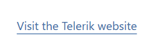
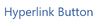
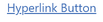

# Hyperlink Button

__RadHyperlinkButton__ provides the RadButton functionality extending it with Hyperlink capabilities. 



## Setting the Content, Uri and the Target

The most common properties for utilizing the control are its __NavigateUri__ and __Content__ properties. The former one is intended to be used for navigating to the needed Uri when __RadHyperlinkButton__ is clicked. The latter one sets the content that will be visualized by the control. Also, the location at which the link to be opened can be set through the __TargetName__ string property.

__Example 1: Setting the NavigateUri and Content__
```XAML
	<telerik:RadHyperlinkButton NavigateUri="http://www.progress.com" Content="Hyperlink Button" TargetName="_blank"/>
```

#### __Figure 1: RadHyperlinkButton in Normal State__


This example shows how a string can be set as a Content of RadHyperlinkButton. The Content can also be set to be an Image, for example. In such setup the link will be opened when the user clicks on the Image.

## Visited and Hovered States

> The default __Foreground__ for the control when the link is visited can be altered via the __VisitedForeground__ property. Also, __RadHyperlinkButton__ provides information whether the link is visited or not through its __IsVisited__ boolean property.

The figure above shows __RadHyperlink__ in its __Normal__ state. When hovered or clicked, the control will be underlined.

#### __Figure 2: RadHyperlinkButton when Hovered or Clicked__


The control will indicate when the link is visited by modifying the text Foreground.

#### __Figure 3: RadHyperlinkButton when the Link is Visited__


## See Also 
 * [Button]()
 * [Radio Button]()
 * [Commands]()
 * [Events]()
 * [Appearance]()
 * [RadToggleButton API](http://www.telerik.com/help/silverlight/t_telerik_windows_controls_radtogglebutton.html)[RadToggleButton API](http://www.telerik.com/help/wpf/t_telerik_windows_controls_radtogglebutton.html).
