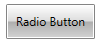
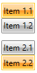
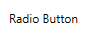
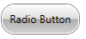

# Radio Button

The __RadRadioButton__ control inherits from the native RadioButton control and implements the __ICommandSource__ interface. Because of the inheritance it has all of the features of the standard RadioButton control. The __ICommandSource__ implementation allows you to attach commands to the button, that will be executed when the RadRadioButton is clicked.	  

>tip You can see how to use an ICommand with a button in the [Commands]() topic.	  

#### __Figure 1: Radio button__


## Defining RadButton

You can instantiate your __RadRadioButton__ in both XAML and code.

__Example 1: Defining a button in XAML__
```XAML
	<telerik:RadRadioButton Content="Radio Item" />
```

__Example 2: Defining a button in code__
```C#
	RadRadioButton radRadioButton = new RadRadioButton() { Content = "Radio Item" };
```
```VB.NET
	Dim radRadioButton As New RadRadioButton() With { _
	    .Content = "Radio Item" _
	}
```

## Button Checked Events

The button provides a set of events that are fired when you click on it. 

* __Checked__: This event is fired when the button is checked.
* __Unchecked__: This event is fired when the button is unchecked.
* __Activate__: This event is fired when the button is checked or unchecked.

>tip As any other button the __RadRadioButton__ exposes a __Click__ event as well.		

The check state of the button can be manually controlled via its __IsChecked__ property.

Here is an example of handling the __Checked__ event of a button.		

__Example 3: Subscribing to the Checked event__  
```XAML
	<telerik:RadRadioButton Content="Radio Item" Checked="RadRadioButton_Checked"/>
```

__Example 4: Defining a Checked event handler__  
```C#
	private void RadRadioButton_Checked(object sender, RoutedEventArgs e)
	{
	    //implement your logic here
	}
```
```VB.NET
	Private Sub RadRadioButton_Checked(sender As Object, e As RoutedEventArgs)
	    'implement your logic here '
	End Sub
```

## Grouping RadRadioButtons

By grouping the __RadRadioButtons__ the user will be allowed to check only one button in the group. In order to group several RadRadioButtons you can place them in the same layout panel (see Example 5).

__Example 5: Grouping radio buttons__  
```XAML
	<StackPanel>
	    <telerik:RadRadioButton Content="Item 1.1" />
	    <telerik:RadRadioButton Content="Item 1.2" />
	</StackPanel>
	<StackPanel>
	    <telerik:RadRadioButton Content="Item 2.1" />
	    <telerik:RadRadioButton Content="Item 2.2" />
	</StackPanel>
```

The above code creates two groups of __RadRadioButtons__.		

#### __Figure 2: Grouped radio buttons__


## Customizing the RadRadioButton

* __IsBackgroundVisible__ - this property is of type bool and it controls the visibility of the background and the border of the RadRadioButton control when in normal state. 
	#### __Figure 2: Radio button with hidden background__
	

* __CornerRadius__: This property controls the corner radius of the button.
	#### __Figure 3: Radio button with its CornerRadius set to 15__
	

## See Also
 * [Button]()
 * [Toggle Button]()
 * [Commands]()
 * [Appearance]()
 * [Events]()
 * [RadRadioButton API](http://www.telerik.com/help/silverlight/t_telerik_windows_controls_radradiobutton.html)[RadRadioButton API](http://www.telerik.com/help/wpf/t_telerik_windows_controls_radradiobutton.html).