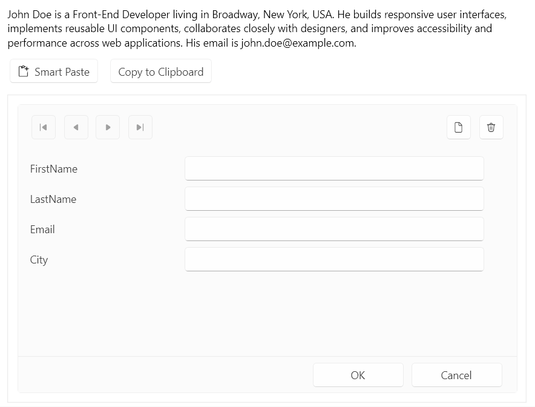
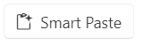

# Smart Paste Button

The Telerik UI for WPF SmartPasteButton is an AI-powered component that streamlines data entry by extracting structured information from clipboard content and automatically populating form fields. When users paste unstructured text copied from the clipboard, the SmartPasteButton sends the content to an AI service, which analyzes the text and returns structured values mapped to the appropriate fields based on the form structure. This improves data entry efficiency and enhances the user experience.

 

## Configuring the SmartPasteButton

The **SmartPasteButton** is designed to work in conjunction with data-bound components such as **DataForm**, **GridView**. It enables users to populate form fields with structured data extracted from unstructured text, streamlining data entry and reducing manual input. This example shows intergration on SmartPasteButton with DataForm.

### __Example: Defining a SmartPasteButton for a Data Form__

When the user clicks the `RadSmartPasteButton`, it reads the text clipboard content. The control obtains the fields from the provider and raises `SmartPasteRequest` with a `SmartPasteButtonRequestContextEventArgs` instance.

1. Add the SmartPasteButton control to your page.

  ```XAML
  <telerik:RadSmartPasteButton x:Name="smartPasteButton"
                               SmartPasteRequest="OnSmartPasteRequest" />
  
  ```
  
  __RadSmartPasteButton__
  
  

2.  Add add a `RadDataForm` to display the fields that the button will populate. Add a **Copy to Clipboard** button to place unstructured text on the clipboard for the Smart Paste operation.

  ```XAML
  <telerik:RadButton Content="Copy to Clipboard"
                     Click="OnCopyToClipboardClick" />
  <telerik:RadDataForm x:Name="dataForm"
                       AutoEdit="True"
                       EditMode="Default" />
  ```

3. Set the `Provider` property to the container whose fields you want to populate. Handle the `SmartPasteRequest` event to send the clipboard content and field information to your AI service.

  ```C#
   this.smartPasteButton.Provider = this.dataForm as ISmartPasteButtonProvider;
  ```

4. Handle the `SmartPasteRequest` event.

  `SmartPasteRequest` event occurs when a smart paste operation is requested. Subscribe to this event to initiate the smart paste logic.
  
  The event arguments provide the clipboard text through `Content` and the available target fields through `Fields`. Send that information to an AI service that can return values keyed by the `SmartPasteButtonField.Field` identifiers. When the service returns, call `SetResponse` with the extracted values.
  
  ```C#
  private void OnCopyToClipboardClick(object sender, RoutedEventArgs e)
  {
      Clipboard.SetText(SampleText);
  }
  
  private async void OnSmartPasteRequest(object sender, SmartPasteButtonRequestContextEventArgs e)
  {
      try
      {
          var request = new { Content = e.Content, FormFields = e.Fields };
          var httpResponse = await new HttpClient().PostAsJsonAsync(
              "https://demos.telerik.com/service/v2/ai/smartpaste/smartpaste",
              request,
              e.CancellationToken);
          httpResponse.EnsureSuccessStatusCode();
  
          var response = await httpResponse.Content.ReadFromJsonAsync<SmartPasteResponse>(e.CancellationToken);
          e.SetResponse(response.FieldValues);
      }
      catch (OperationCanceledException)
      {
          e.Cancel();
      }
      catch (Exception ex)
      {
          e.SetError(ex);
      }
  }  
  ```

>tip Runnable example with the SmartPasteButton integration with DataForm is available in our [Telerik UI for Wpf Demo](https://demos.telerik.com/wpf/). 

## Processing the Request

The `SmartPasteButtonRequestContextEventArgs` instance provides the data that the `SmartPasteRequest` event and `SmartPasteRequestCommand` require to process a smart paste operation. Send the clipboard text from `Content` and the available target fields from `Fields` to your AI service. The service must return values keyed by the `SmartPasteButtonField.Field` identifiers.

The following table lists the members that support a smart paste request.

| Property | Description |
| --- | --- |
| `Content` | The untrusted text content from the clipboard. Treat it as data when you construct prompts for an AI service. |
| `Fields` | The fields that the AI service must extract values for. |
| `CancellationToken` | A token that is canceled when the user cancels the operation. Pass the token to asynchronous operations. |
| `SetResponse` | Completes the request with a dictionary that maps field identifiers to extracted values. The control converts and applies the values through the provider. |
| `SetError` | Completes the request with an error. |
| `Cancel` | Cancels the request without applying values. |

>important Call `SetResponse` when the AI service returns the extracted values. Call `SetError` when the request fails, or `Cancel` when the operation is canceled. A second click while the button is processing a request cancels the operation and signals `CancellationToken`.

## Describing SmartPasteButtonField

Each `SmartPasteButtonField` identifies a target field and gives the AI service context for extracting a value. The provider returns these fields through `GetFields` and receives the final values through `SetFieldValue`.

The following table lists the field metadata available to the AI service.

| Property | Description |
| --- | --- |
| `Field` | The unique identifier that the response dictionary uses to map a value to a target field. |
| `Description` | A human-readable label that helps the AI service identify the field. |
| `AllowedValues` | The values that the field accepts. |
| `Type` | The full CLR type name for the field value. |
| `FieldType` | The CLR `Type` that the control uses to convert the returned value before assignment. |

Use `FieldType` to enable type conversion for common .NET types, including numbers, Boolean values, dates, times, GUIDs, and enumerations.

## Customizing the SmartPasteButton

The button derives from [`RadButton`]() and supports its standard appearance settings. The following properties customize the content and icon that the button displays before and during a smart paste operation.

| Property | Description |
| --- | --- |
| `IsProcessing` | Read-only property. Indicates whether a smart paste operation is in progress. When the value is `true`, the button displays its processing visual state. |
| `ProcessingContent` | Specifies the content that the button displays during a smart paste operation. When you do not set this property, the button displays its default processing content. |
| `ProcessingIconContent` | Specifies the content in the icon area while the button processes a request. |
| `IconContent` | Specifies the content in the icon area when the button is not processing a request. |
| `IconContentTemplate` | Specifies the `DataTemplate` that renders `IconContent`. |
| `IconForeground` | Specifies the `Brush` that renders the button icon glyph. |

## See Also

* [RadButtons Overview]()
* [RadDataForm Overview]()
* [Telerik UI for WPF API Reference](https://docs.telerik.com/devtools/wpf/api/)

