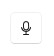
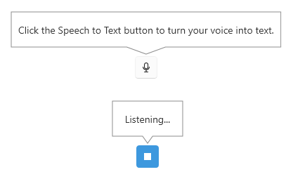
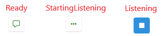
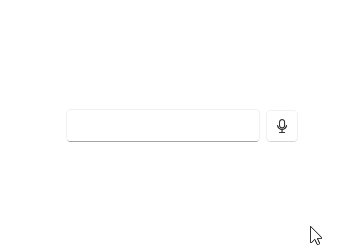

# Speech-to-Text Button

The `RadSpeechToTextButton` control allows you to capture spoken input and convert it to text. 

The component has a built-in speech recognizer based on Web Speech API utilized via [WebView2](https://learn.microsoft.com/en-us/microsoft-edge/webview2/). The button automatically detects microphone input when the it is in listening state and converts the audio to text. The default recognizer allows you to also set the language for speech recognition, ensuring accurate transcription of spoken words.



## Basic Usage

To start using the `RadSpeechToTextButton` control, just define it in the view. To get the processed text, use the `SpeechRecognized` event.

The default speech recognizer of the button requires you to install the [Microsoft.Web.WebView2](https://www.nuget.org/packages/microsoft.web.webview2) NuGet package (minimum version: 1.0.3650.58). Also, when the button gets loaded, the WebView2 will prompt you to allow listening to microphone input.

__Setting up a RadSpeechToTextButton__

```XAML
<telerik:RadSpeechToTextButton SpeechRecognized="RadSpeechToTextButton_SpeechRecognized"/>
```

__Using the SpeechRecognized event__

```C#
private void RadSpeechToTextButton_SpeechRecognized(object sender, Telerik.SpeechRecognizer.SpeechRecognizerSpeechRecognizedEventArgs e)
{
    string fullText = e.FullText;
}
```

## Processing Recognized Text

Each time when the speech recognizer manages to process audio input, it raises the `SpeechRecognized` event which contains information about the converted text. 

The `SpeechRecognizerSpeechRecognizedEventArgs` provides the recognized text and the corresponding confidence score. The score is a value between 0 and 1, indicating how confident the speech-to-text transcription is. A value of -1 indicates no score could be provided.

__Defining a SpeechRecognized event handler__

```C#
private void RadSpeechToTextButton_SpeechRecognized(object sender, Telerik.SpeechRecognizer.SpeechRecognizerSpeechRecognizedEventArgs e)
{
    string fullText = e.FullText;
    double confidenceScore = e.FullTextConfidenceScore;
}
```

## Continuous vs. One-Time Recognition 

By default when the RadSpeechToTextButton is pressed this will start a continuous listening action which will process speech until the button is pressed again to stop listening. This behavior can be changed by setting the `IsContinuousRecognition` property to `false`. In this case, the recognizer will stop automatically after a single utterance or pause.

__Disabling continuous speech recognition__

```XAML
<telerik:RadSpeechToTextButton IsContinuousRecognition="False" />
```

## Recognizer States

The speech recognizer can be in few different states - read, listening, stop listening, etc. The current state can be acquired using the `State` property of `RadSpeechToTextButton`.

The recognizer can be in the following states:

* `NotInitialized`
* `Initializing`
* `Ready`
* `StartingListening`
* `Listening`
* `StoppingListening`
* `Faulted`
* `Resetting`
* `Disposing`
* `Disposed`

__Getting the current status of the recognizer__

```C#
SpeechRecognizerState state = this.speechToTextButton.State;
```

## Handling Speech Recognition Errors

To handle errors related to the speech recognition service, use the `ErrorOccurred` event. The `SpeechRecognizerErrorOccurredEventArgs` provide information about the error message via the `Message` and `Exception` properties.

__Defining a ErrorOccurred event handler__

```C#
private void Btn_ErrorOccurred(object? sender, Telerik.SpeechRecognizer.SpeechRecognizerErrorOccurredEventArgs e)
{
	string errorMessage = e.Message;
	Exception exception = e.Exception;
}
```

## Language Support

The service used by the default WebView2 speech recognizer supports multiple languages. The default language comes from the current culture of the system, but this can be changed via the `LanguageTag` property. The property works with the IETF language tags (e.g., "en-US", "de-DE", "fr-FR", etc.).

__Setting the language of the default speech recognizer to German__

```XAML
<telerik:RadSpeechToTextButton LanguageTag="de-DE"/>
```

## Customizing the ToolTip

`RadSpeechToTextButton` displays a tooltip (callout) on mouse over, which shows the current state of the button. By default the tooltip is displayed for the `Ready` and `Listening` [states](#recognizer-states).



The tooltip content and behavior can be customized using the `CalloutOpening` event.

__Replacing the tooltip content of the button when in Ready and Listening states__

```C#
private void RadSpeechToTextButton_CalloutOpening(object? sender, SpeechToTextTooltipOpeningEventArgs e)
{
    var button = (RadSpeechToTextButton)sender;
    if (button.State == SpeechRecognizerState.Ready)
    {
        e.Callout.Content = "Click when you're ready to speak";
    }
    else if (button.State == SpeechRecognizerState.Listening)
    {
        e.Callout.Content = "I’m listening";
    }
}
```

The event is invoked only for the [states](#recognizer-states) added in the `ToolTipStates` collection of `RadSpeechToTextButton`. By default the collection contains only the `Ready` and `Listening` states. If the recognizer is in another state the tooltip won't be displayed. 

To __show the tooltip for other states__ as well, add these in the `ToolTipStates` collection, and then use the `CalloutOpening` event handler to add content for the extra states.

__Adding extra states and adjust their content__

```C#
public MainWindow()
{
    InitializeComponent();
    
	this.speechToTextButton.ToolTipStates.Add(SpeechRecognizerState.StartingListening);
	this.speechToTextButton.ToolTipStates.Add(SpeechRecognizerState.Faulted);
}

private void RadSpeechToTextButton_CalloutOpening(object? sender, SpeechToTextTooltipOpeningEventArgs e)
{
    var button = (RadSpeechToTextButton)sender;            
    if (button.State == SpeechRecognizerState.StartingListening)
    {
        e.Callout.Content = "Starting listening...";
    }
    else if (button.State == SpeechRecognizerState.Faulted)
    {
        e.Callout.Content = "Error";
    }
}
```

In the example above, only the content for the `StartingListening` and `Faulted` states is set in the event handler, because the internal logic of the control manages the only content for the `Ready` and `Listening` states by default.

To __prevent the tooltip from opening__, set the `e.Cancel` property of the event arguments to `true`.

__Using the CalloutOpening event to cancel the tooltip opening__

```C#
private void RadSpeechToTextButton_CalloutOpening(object? sender, SpeechToTextTooltipOpeningEventArgs e)
{
    e.Cancel = true;
}
```

The tooltip visual is implemented with the [RadCallout]() control. The `SpeechToTextTooltipOpeningEventArgs` provide [settings]() for customizing the callout via the `CalloutPopupSettings` property of the event args. 

__Using the CalloutOpening event to change the show/close animation__

```C#
private void RadSpeechToTextButton_CalloutOpening(object? sender, SpeechToTextTooltipOpeningEventArgs e)
{
    CalloutPopupSettings settings = e.CalloutPopupSettings;            
    settings.CloseAnimationType = CalloutAnimation.FadeAndScale;
    settings.ShowAnimationType = CalloutAnimation.FadeAndScale;
}
```

## Customizing the Button Content

The content of the button can be changed via the the `ContentTemplateSelector` property. This can be used to replace  the default icons displayed for `Ready`, `Listening` and `Faulted` states and to include extra content for other states like `StartingListening`, `StoppingListening`.

__Defining custom content template selector__

```C#
 public class CustomContentTemplateSelector : DataTemplateSelector
 {
     public DataTemplate ReadyTemplate { get; set; }
     public DataTemplate StartingListeningTemplate { get; set; }
     public DataTemplate ListeningTemplate { get; set; }

     public override DataTemplate SelectTemplate(object item, DependencyObject container)
     {
         var state = (SpeechRecognizerState)item;
         if (state == SpeechRecognizerState.Ready)
         {
             return ReadyTemplate;
         }
         else if (state == SpeechRecognizerState.StartingListening)
         {
             return StartingListeningTemplate;
         }
         else if (state == SpeechRecognizerState.Listening)
         {
             return ListeningTemplate;
         }
         return ReadyTemplate;
     }
 }
```

__Defining custom content__

```XAML
<telerik:RadSpeechToTextButton>
    <telerik:RadSpeechToTextButton.ContentTemplateSelector>
        <local:CustomContentTemplateSelector>
            <local:CustomContentTemplateSelector.ReadyTemplate>
                <DataTemplate>
                    <telerik:RadGlyph Glyph="&#xe655;" Foreground="Green" />
                </DataTemplate>
            </local:CustomContentTemplateSelector.ReadyTemplate>
            <local:CustomContentTemplateSelector.ListeningTemplate>
                <DataTemplate>
                    <telerik:RadGlyph Glyph="&#xe20e;" Foreground="#ffffff" />
                </DataTemplate>
            </local:CustomContentTemplateSelector.ListeningTemplate>
            <local:CustomContentTemplateSelector.StartingListeningTemplate>
                <DataTemplate>
                    <telerik:RadGlyph Glyph="&#xe032;"/>
                </DataTemplate>
            </local:CustomContentTemplateSelector.StartingListeningTemplate>
        </local:CustomContentTemplateSelector>
    </telerik:RadSpeechToTextButton.ContentTemplateSelector>
</telerik:RadSpeechToTextButton>
```



## Implementing Custom Speech Recognizer

The `RadSpeechToTextButton` allows you to implement custom speech recognizer in order to integrate a speech-to-text service or a library of your choice.

A custom recognizer is created by implementing the `IRadSpeechRecognizer` interface. The custom implementation can be enabled with the `SpeechRecognizerCreator` property of the control.

__Implementing custom speech recognizer__

```C#
public class CustomSpeechRecognizer : IRadSpeechRecognizer
{
	private const string MockText = "This is a mocked speech recognizer response for testing purposes and it will not really do a voice transcription in your system.";
	
	private SpeechRecognizerState state;
	private int reportingSessionId;

	public SpeechRecognizerState State
	{
		get => this.state;
		private set
		{
			if (this.state != value)
			{
				this.state = value;
				this.StateChanged?.Invoke(this, EventArgs.Empty);
			}
		}
	}

	public event EventHandler StateChanged;
	public event EventHandler<SpeechRecognizerErrorOccurredEventArgs> ErrorOccurred;
	public event EventHandler<SpeechRecognizerSpeechRecognizedEventArgs> SpeechRecognized;

	public Task Init(SpeechRecognizerInitializationContext context)
	{
		this.State = SpeechRecognizerState.Ready;
		this.reportingSessionId++;
		return Task.CompletedTask;
	}

	public Task StartListening()
	{
		this.State = SpeechRecognizerState.StartingListening;
		this.reportingSessionId++;
		int localSessionId = this.reportingSessionId;

		Task.Run(() =>
		{
			this.State = SpeechRecognizerState.Listening;
			int i = 0;
			string[] words = MockText.Split(' ', StringSplitOptions.RemoveEmptyEntries);
			string fullText = string.Empty;

			while (true)
			{
				string word = words[i % words.Length];
				fullText += $" {word}";
				i++;

				Thread.Sleep(333);

				if (localSessionId != this.reportingSessionId)
				{
					break;
				}

				this.SpeechRecognized?.Invoke(this, new SpeechRecognizerSpeechRecognizedEventArgs(fullText));
			}
		});

		return Task.CompletedTask;
	}

	public async Task StopListening()
	{
		this.State = SpeechRecognizerState.Ready;
		this.reportingSessionId++;
		await Task.Yield();
	}

	public Task Reset()
	{
		this.State = SpeechRecognizerState.NotInitialized;
		this.reportingSessionId++;
		return Task.CompletedTask;
	}

	public ValueTask DisposeAsync()
	{
		this.State = SpeechRecognizerState.Disposed;
		this.reportingSessionId++;
		return ValueTask.CompletedTask;
	}
}
```

__Defining example view with RadSpeechToTextButton__

```XAML
 <StackPanel Orientation="Horizontal">
     <telerik:RadWatermarkTextBox x:Name="tbInput" Width="200" TextWrapping="Wrap" AcceptsReturn="True"/>
     <telerik:RadSpeechToTextButton x:Name="speechToTextButton" SpeechRecognized="RadSpeechToTextButton_SpeechRecognized" Focusable="False"/>           
 </StackPanel>
```

__Assigning the custom speech recognizer and handling the result__

```C#
public MainWindow()
{    
    InitializeComponent();
 
    this.speechToTextButton.SpeechRecognizerCreator = () =>
    {
        return new CustomSpeechRecognizer();
    };
}

private void RadSpeechToTextButton_SpeechRecognized(object sender, Telerik.SpeechRecognizer.SpeechRecognizerSpeechRecognizedEventArgs e)
{
    string fullText = e.FullText;
    this.tbInput.Text = fullText;
    this.tbInput.CaretIndex = this.tbInput.Text.Length;
}
```

