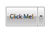
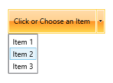
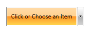
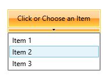

# Split Button

`RadSplitButton` is a UI combination of RadButton and RadDropDownButton.

A `RadButton` element represents the ButtonPart, while the `RadDropDownButton` represents the DropDownPart. See the different parts of RadSplitButton in the [Visual Structure](#radsplitbutton) article. 

> RadSplitButton looks very similar to RadDropDownButton. The main difference is that RadSplitButton has two separate parts - a clickable button and a button that opens the drop down. On the other hand, RadDropDownButton combines those two actions into a single button.

The split button control implements the `ICommandSource` interface, which allows you to attach commands to the ButtonPart, that will be executed when the button is clicked. Read more about this in the [Commands]() article.

## Instantiating RadSplitButton

> In order to use the RadSplitButton class, you will need to add а reference to `Telerik.Windows.Controls.dll`.

You can instantiate `RadSplitButton` both in XAML and code.

__Defining a button in XAML__
```XAML
	<telerik:RadSplitButton Content="Click Me!" />
```

__Defining a button in code__
```C#
	RadSplitButton radSplitButton = new RadSplitButton() { Content = "Click Me!" };
```
```VB.NET
	Dim radSplitButton As New RadSplitButton() With { _
	    .Content = "Click Me!" _
	}
```

__RadSplitButton__



## Adding DropDown Content

In order to add content to the drop-down area of RadSplitButton, use its `DropDownContent` property.

__Adding ListBox as a drop down content__
```XAML
	<telerik:RadSplitButton AutoOpenDelay="0:0:0.0" Content="Click or Choose an Item">
	    <telerik:RadSplitButton.DropDownContent>
	        <ListBox>
	            <ListBoxItem Content="Item 1" />
	            <ListBoxItem Content="Item 2" />
	            <ListBoxItem Content="Item 3" />
	        </ListBox>
	    </telerik:RadSplitButton.DropDownContent>
	</telerik:RadSplitButton>
```

>tip Additionally, the control provides `DropDownContentTemplate` and `DropDownContentTemplateSelector` properties, that can be used to customize the drop down content in a data binding scenario. Read more about data templates in the [Data Templating Overview](https://msdn.microsoft.com/en-us/library/ms742521(v=vs.100).aspx) MSDN article.

__RadSplitButton with dropdown content__



## Toggling the RadSplitButton

The ButtonPart of the split button can behave as a toggle button. To enable this, set the `IsToggle`  property of RadSplitButton to `True`.

__Enable toggle mode__
```XAML
	<telerik:RadSplitButton IsToggle="True" />
```

__RadSplitButton as a toggle button__



## Auto Opening

You can allow the RadSplitButton to automatically display its DropDownContent, when you __mouse over the button__. This behaviour is controlled via the `AutoOpenDelay` property of RadSplitButton. The property specifies the time, after which the drop down content is displayed. 

To disable the auto-opening feature of the control, set the `AutoOpenDelay` to `0`.

__Setting the AutoOpenDelay property__
```XAML
	<telerik:RadSplitButton AutoOpenDelay="0:0:0.5" />
```

## Customizing the RadSplitButton

You can easily customize RadSplitButton by using the following properties:		

* `IsOpen`&mdash;Specifies whether the DropDownContent of the button is opened.

* `IsChecked`&mdash;Specifies the checked state of the button when its ButtonPart behaves like a toggle button. To make this property work, the `IsToggle` property should be set to `true`.

* `CloseOnEscape`&mdash;Specifies whether the drop-down should be closed when the `Esc` key gets pressed. The default value is `True`.

* `ButtonPartStyle`&mdash;Allows you to define a `Style` for the ButtonPart of the RadSplitButton. The `TargetType` expected by the Style is `RadButton`.

* `TogglePartStyle`&mdash;Allows you to define a `Style` for the ButtonPart of RadSplitButton when it is in toggle button mode. The `TargetType` expected by the Style is `RadToggleButton`.

* `CornerRadius`&mdash;Specifies the corner radius of RadSplitButton.

* `ToggleCornerRadius`&mdash;Specifies the corner radius of the ButtonPart, when it behaves like a toggle button.

* `IsBackgroundVisible`&mdash;Controls the visibility of the background and the border of the RadSplitButton control in normal state.

* `IsButtonPartVisible`&mdash;Specifies whether the ButtonPart is visible.

* `DropDownButtonPosition`&mdash;Specifies the position of the drop down arrow. The possible values are `Bottom`, `Left`, `Right` (default), `Top`.

* `DropDownIndicatorVisibility`&mdash;Specifies whether the drop-down arrow should be visible. The default value is `Visible`.

* `DropDownPlacement`&mdash;Specifies where the drop down area should be placed - `Absolute`, `Bottom`, `Center`, `Left`, `Right`, `Top`.

* `DropDownWidth`&mdash;Specifies the width of the drop-down area.

* `DropDownHeight`&mdash;Specifies the height of the drop-down area.

* `DropDownMaxHeight`&mdash;Specifies the maximal height of the drop-down area.

* `DropDownMaxWidth`&mdash;Specifies the maximal width of the drop-down area.

* `CloseOnPopupMouseLeftButtonUp`&mdash;Specifies whether the drop-down area should be closed when the user clicks on the `DropDownContent` of the control. The closing of the drop-down is executed on the `MouseLeftButtonUp` event of the `Popup` control. The default value is `False`.

__Customizing RadSplitButton__
```XAML
	<telerik:RadSplitButton DropDownButtonPosition="Bottom" 
							Content="Click or Choose an Item" 
							DropDownWidth="{Binding ActualWidth, RelativeSource={RelativeSource Self}}">
		<telerik:RadSplitButton.DropDownContent>
			<ListBox>
				<ListBoxItem Content="Item 1" />
				<ListBoxItem Content="Item 2" />
				<ListBoxItem Content="Item 3" />
			</ListBox>
		</telerik:RadSplitButton.DropDownContent>
	</telerik:RadSplitButton>
```

__Customized RadSplitButton__



## See Also
 * [RadSplitButton API Reference](http://www.telerik.com/help/wpf/installation-installing-controls-dependencies-wpf.html)[RadSplitButton API Reference](http://www.telerik.com/help/silverlight/installation-installing-controls-dependencies.html)
 * [Button]()
 * [DropDown Button]()
 * [Commands]()
