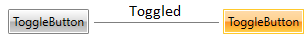
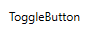
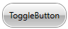

# Toggle Button

__RadToggleButton__ inherits from the native __ToggleButton__ control and implements the [ICommandSource](https://msdn.microsoft.com/en-us/library/system.windows.input.icommand(v=vs.110).aspx) interface. Because of the inheritance, it has all of the features of the native __ToggleButton__ control. The __ICommandSource__ implementation allows you to attach commands to the button, which will get executed when it gets clicked.	  

>tip You can see how to use ICommand with a button in the [Commands]() topic.	  

#### __Figure 1: Toggle button__


## Defining RadToggleButton

You can instantiate __RadToggleButton__ in both XAML and code as shown in Examples 1 and 2.

__Example 1: Defining a button in XAML__
```XAML
	<telerik:RadToggleButton Content="Toggle Me!" />
```

__Example 2: Defining a button in code__
```C#
	RadToggleButton radToggleButton = new RadToggleButton() { Content = "Toggle Me!" };
```
```VB.NET
	Dim radToggleButton As New RadToggleButton() With { _
	    .Content = "Toggle Me!" _
	}
```

## Enable Three State Mode

To make __RadToggleButton__ to go into a three state mode you can just set its __IsThreeState__ property to __True__.

__Example 5: Enabling the three-state mode__
```XAML
	<telerik:RadToggleButton IsThreeState="True" />
```

## Toggle Events

The button provides a set of events that are fired when you toggle it. 

* __Checked__: This event is fired when the button is toggled on.
* __Unchecked__: This event is fired when the button is toggled off.
* __Activate__: This event is fired when the button is toggled on or off.

>tip As any other button, RadToggleButton exposes a __Click__ event, too. Additionally, the control has __PreviewClick__ event.

The toggle state of the button can be manually controlled via its __IsChecked__ property.

Here is an example of handling the __Checked__ event of a button.

__Example 3: Subscribing to the Checked event__
```XAML
	<telerik:RadToggleButton Content="Toggle Me!" Checked="RadToggleButton_Checked" />
```

__Example 4: Defining a Checked event handler__
```C#
	private void RadToggleButton_Checked(object sender, RoutedEventArgs e)
	{
	    //implement your logic here
	}
```
```VB.NET
	Private Sub RadToggleButton_Checked(sender As Object, e As RoutedEventArgs)
	    'implement your logic here'
	End Sub
```

## Customizing RadToggleButton

* __IsBackgroundVisible__: This property controls the visibility of the background and the border of the button when in normal state.
	#### __Figure 2: Toggle button with hidden background__
	

* __CornerRadius__: This property controls the corner radius of the button.
	#### __Figure 3: Toggle button with its CornerRadius set to 15__
	

## See Also 
 * [Button]()
 * [Radio Button]()
 * [Commands]()
 * [Events]()  