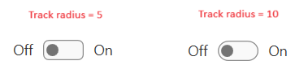

# Toggle Switch Button

__RadToggleSwitchButton__ is a control designed to display two exclusive choices. The control is represented by a track in which the thumb is smoothly sliding left and right. The two states content can be customized along with their position. The button derives from our __RadToggleButton__ control. Because of the inheritance, it has all of the features of the __RadToggleButton__ control. 

>tip You can see how to use ICommand with a button in the [Commands]() topic.	  

__Toggle Switch Button__  


## Defining RadToggleSwitchButton

You can instantiate __RadToggleSwitchButton__ in both XAML and code as shown in Examples 1 and 2.

__Defining a toggle switch button in XAML__
```XAML
	<telerik:RadToggleSwitchButton ContentPosition="Both" CheckedContent="ON" UncheckedContent="OFF" />
```

__Defining a toggle switch button in code__
```C#
	RadToggleSwitchButton radToggleSwitchButton = new RadToggleSwitchButton() { CheckedContent = "ON", UncheckedContent = "OFF" };
```
```VB.NET
	Dim radToggleSwitchButton As New RadToggleSwitchButton() With { 
	    .CheckedContent = "ON" 
		.UncheckedContent = "OFF"
	}
```

## Setting Content Position

The RadToggleSwitchButton allows you to control the position of its CheckedContent and UncheckedContent. You can do that using its __ContentPosition__ property. This property is an enumeration of type __SwitchButtonContentPosition__ and exposes the following values.

* __Both__	
* __Right (default)__
* __Left__ 

__ContentPosition property__  


 
## Enabling Three-State Mode

To make __RadToggleSwitchButton__ to go into a three-state mode you can just set its __IsThreeState__ property to __True__.

__Enabling the three-state mode__
```XAML
	<telerik:RadToggleSwitchButton IsThreeState="True" ContentPosition="Both" CheckedContent="ON" UncheckedContent="OFF" />
```

## Setting Checked and Unchecked Content

Nevertheless, the RadToggleSwitchButton derives from RadToggleButton, the Content property here is not respected. Two new properties are created. These properties set the check and uncheck content state of the ToggleSwitchButton. Their position depends on the __ContentPosition__ property.

__Setting Check/UncheckContent property__
```XAML
	<telerik:RadToggleSwitchButton CheckedContent="Red" UncheckedContent="Green" />
```

## Setting Track Size

To customize the size of the ToggleSwitchButton's track use its `TrackWidth` and `TrackHeight` properties.

__Setting track size properties__
```XAML
	<telerik:RadToggleSwitchButton UncheckedContent="Red" CheckedContent="Green" ContentPosition="Both" TrackHeight="30" TrackWidth="90" />
```

__Change Track Height/Width__  


## Setting Thumb Size

To customize the size of the ToggleSwitchButton's thumb use its `ThumbWidth` and `ThumbHeight` properties.

__Setting thumb size properties__
```XAML
	<telerik:RadToggleSwitchButton UncheckedContent="Red" CheckedContent="Green" ContentPosition="Both" TrackHeight="30" TrackWidth="90" ThumbHeight="15" ThumbWidth="50"/>
```

__Change Thumb Height/Width__  


## Setting Track Corner Radius

To set the corner radius of the track, set the `CheckedTrackRadius` and `UncheckedTrackRadius` properties of the button.

__Setting track corner radius properties__
```XAML
	<telerik:RadToggleSwitchButton ContentPosition="Both" 
				       CheckedContent="On" 
				       UncheckedContent="Off"
				       CheckedTrackRadius="10"
				       UncheckedTrackRadius="10"/>
```

__Tracks with radiuses of 5 and 10 pixels__  



## See Also 
 * [Button]()
 * [Radio Button]()
 * [Commands]()
 * [Events]() 
 * [RadToggleButton API](http://www.telerik.com/help/silverlight/t_telerik_windows_controls_radtogglebutton.html)[RadToggleButton API](http://www.telerik.com/help/wpf/t_telerik_windows_controls_radtogglebutton.html).
