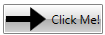
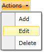
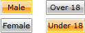
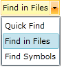
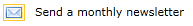
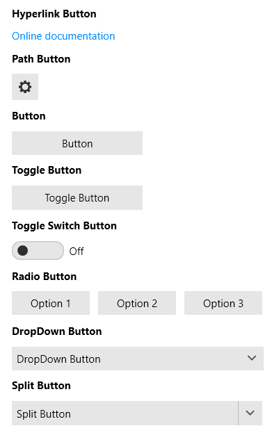

# Getting Started with {{ site.framework_name }} Buttons

This tutorial will walk you through the creation of a sample application that contains Telerik buttons. 

## Assembly References
 
In order to use RadButtons in your project you have to add a reference to the following assemblies:
* __Telerik.Windows.Controls__

You can find the required assemblies for each control from the suite in the [Controls Dependencies]()[Controls Dependencies]() help article.

### Adding Telerik Assemblies Using NuGet

To use __RadButton__ when working with NuGet packages, install the `Telerik.Windows.Controls.for.Wpf.Xaml` package. The [package name may vary]() slightly based on the Telerik dlls set - [Xaml or NoXaml]()

Read more about NuGet installation in the [Installing UI for WPF from NuGet Package]() article.

## RadButton

Here is an example of a __RadButton__ that executes some logic when it is clicked.

#### __[XAML] Example 1: Defining a button in XAML__
{{region xaml-radbuttons-getting-started_0}}
	<telerik:RadButton x:Name="radButton" 
	                    HorizontalAlignment="Left"
	                    VerticalAlignment="Top"
	                    Click="radButton_Click"
	                    Content="Click Me!" />
{{endregion}}

#### __[C#] Example 2: Defining a Click event handler__
{{region cs-radbuttons-getting-started_1}}
	private void radButton_Click(object sender, RoutedEventArgs e)
	{
	    //implement your logic here.
	}
{{endregion}}

#### __[VB.NET] Example 2: Defining a Click event handler__
{{region vb-radbuttons-getting-started_2}}
	Private Sub radButton_Click(sender As Object, e As RoutedEventArgs)
	    'implement your logic here. '
	End Sub
{{endregion}}

## RadPathButton

The greatest advantage of this control is that users can visualize a custom path geometry in the button. Also, the geometry can be positioned relatively to the __Content__ of the button. Here is an example of a __RadPathButton__ that executes some logic when it is clicked.
  
#### __[XAML] Example 3: Defining a path button in XAML__  
{{region xaml-radbuttons-getting-started_7}}
	<telerik:RadPathButton x:Name="pathButton"
	                   Width="100"
	                   Height="30"
	                   Margin="20"
	                   Click="pathButton_Click"
	                   ContentPlacement="Right"
	                   Content="Click Me!"
	                   PathGeometry="M3,7L9,7L9,4L13,8L9,12L9,9L3,9z" />
{{endregion}}

#### __[C#] Example 4: Defining a Click event handler__  
{{region cs-radbuttons-getting-started_8}}
	private void pathButton_Click(object sender, RoutedEventArgs e)
	{
	    //implement your logic here.
	}
{{endregion}}

#### __[VB.NET] Example 4: Defining a Click event handler__  
{{region vb-radbuttons-getting-started_9}}
	Private Sub pathButton_Click(sender As Object, e As RoutedEventArgs)
	    'implement your logic here.'
	End Sub
{{endregion}}

## RadDropDownButton

Here is an example of a __RadDropDownButton__ that contains a list of actions in its DropDown Content.

#### __[XAML] Example 5: Defining a drop down button__  
{{region xaml-radbuttons-getting-started_3}}
	<telerik:RadDropDownButton HorizontalAlignment="Left" 
	                           VerticalAlignment="Top"
	                           Content="Actions">
	    <telerik:RadDropDownButton.DropDownContent>
	        <telerik:RadContextMenu>
	            <telerik:RadMenuItem Header="Add" />
	            <telerik:RadMenuItem Header="Edit" />
	            <telerik:RadMenuItem Header="Delete" />
	        </telerik:RadContextMenu>
	    </telerik:RadDropDownButton.DropDownContent>
	</telerik:RadDropDownButton>
{{endregion}}

## RadRadioButton

Here is an example of several __RadRadioButtons__ placed in two groups.

#### __[XAML] Example 6: Defining a radio button__  
{{region xaml-radbuttons-getting-started_4}}
	<StackPanel HorizontalAlignment="Left" 
	            VerticalAlignment="Top"
	            Orientation="Horizontal">
	    <StackPanel Margin="0,0,20,0">
	        <telerik:RadRadioButton Margin="0,0,0,5" Content="Male" />
	        <telerik:RadRadioButton Content="Female" />
	    </StackPanel>
	    <StackPanel>
	        <telerik:RadRadioButton Margin="0,0,0,5" Content="Over 18" />
	        <telerik:RadRadioButton Content="Under 18" />
	    </StackPanel>
	</StackPanel>
{{endregion}}

## RadSplitButton

Here is an example of a __RadSplitButton__ definition, where a __ListBox__ control is used to display a list of items in the __RadSplitButton__ __DropDownContent__. The __Content__ of the __RadSplitButton__ is bound to the __SelectedItem__ of the __ListBox__.

#### __[XAML] Example 7: Defining a split button__
{{region xaml-radbuttons-getting-started_5}}
	<telerik:RadSplitButton HorizontalAlignment="Left" 
	                        VerticalAlignment="Top"
	                        Content="{Binding Path=SelectedItem.Content, ElementName=FindActions}">
	    <telerik:RadSplitButton.DropDownContent>
	        <ListBox x:Name="FindActions" SelectionMode="Single">
	            <ListBoxItem Content="Quick Find" IsSelected="True" />
	            <ListBoxItem Content="Find in Files" />
	            <ListBoxItem Content="Find Symbols" />
	        </ListBox>
	    </telerik:RadSplitButton.DropDownContent>
	</telerik:RadSplitButton>
{{endregion}}

## RadToggleButton

Here is an example of a __RadToggleButton__ that toggles the "Monthly Newsletter" feature of a form.

#### __[XAML] Example 8: Defining a toggle button__
{{region xaml-radbuttons-getting-started_6}}
	<StackPanel HorizontalAlignment="Left" 
	            VerticalAlignment="Top"
	            Orientation="Horizontal">
	    <telerik:RadToggleButton Margin="0,0,10,0">
	        <telerik:RadToggleButton.Content>
	            <Image Source="/Silverlight.Help.RadButtons;component/Demos/Images/newsletter.png" Stretch="None" />
	        </telerik:RadToggleButton.Content>
	    </telerik:RadToggleButton>
	    <TextBlock Text="Send a monthly newsletter" />
	</StackPanel>
{{endregion}}

## RadToggleSwitchButton

Here is an example of a __RadToggleSwitchButton__ that switches between __ON__ and __OFF__ state.

#### __[XAML] Example 9: Defining a toggle switch button__
{{region xaml-radbuttons-getting-started_7}}
	<Grid>
		<telerik:RadToggleSwitchButton ContentPosition="Both" CheckedContent="ON" UncheckedContent="OFF" />
	</Grid>
{{endregion}}

## Setting a Theme

The controls from our suite support different themes. You can see how to apply a theme different than the default one in the [Setting a Theme]() help article.

>important Changing the theme using implicit styles will affect all controls that have styles defined in the merged resource dictionaries. This is applicable only for the controls in the scope in which the resources are merged. 

To change the theme, you can follow the steps below:

* Choose between the themes and add reference to the corresponding theme assembly (ex: **Telerik.Windows.Themes.Fluent.dll**). You can see the different themes applied in the **Theming** examples from our [WPF Controls Examples](https://demos.telerik.com/wpf/)[Silverlight Controls Examples](https://demos.telerik.com/silverlight/#Buttons/Theming) application.

* Merge the ResourceDictionaries with the namespace required for the controls that you are using from the theme assembly. For the __RadButton's__, you will need to merge the following resources:

	* __Telerik.Windows.Controls__

__Example 10__ demonstrates how to merge the ResourceDictionaries so that they are applied globally for the entire application.

#### __[XAML] Example 10: Merge the ResourceDictionaries__  
{{region xaml-radbuttons-getting-started_5}}
	<Application.Resources>
		<ResourceDictionary>
			<ResourceDictionary.MergedDictionaries>
				<ResourceDictionary Source="/Telerik.Windows.Themes.Fluent;component/Themes/System.Windows.xaml"/>
				<ResourceDictionary Source="/Telerik.Windows.Themes.Fluent;component/Themes/Telerik.Windows.Controls.xaml"/>
			</ResourceDictionary.MergedDictionaries>
		</ResourceDictionary>
	</Application.Resources>
{{endregion}}

>Alternatively, you can use the theme of the control via the [StyleManager](https://docs.telerik.com/devtools/wpf/styling-and-appearance/stylemanager/common-styling-apperance-setting-theme-wpf)[StyleManager](https://docs.telerik.com/devtools/silverlight/styling-and-appearance/stylemanager/common-styling-apperance-setting-theme).

__Figure 1__ shows a __RadButtons__ with the **Fluent** theme applied.
	
#### __Figure 1: RadButtons with the Fluent theme__


## Telerik UI for WPF Learning Resources

* [Telerik UI for WPF Buttons Component](https://www.telerik.com/products/wpf/button.aspx)
* [Getting Started with Telerik UI for WPF Components]()
* [Telerik UI for WPF Installation]()
* [Telerik UI for WPF and WinForms Integration]()
* [Telerik UI for WPF Visual Studio Templates]()
* [Setting a Theme with Telerik UI for WPF]()
* [Telerik UI for WPF Virtual Classroom (Training Courses for Registered Users)](https://learn.telerik.com/learn/course/external/view/elearning/16/telerik-ui-for-wpf) 
* [Telerik UI for WPF License Agreement](https://www.telerik.com/purchase/license-agreement/wpf-dlw-s)


## See Also  
 * [Visual Structure]()
 * [Commands]()
 * [Events]() 
