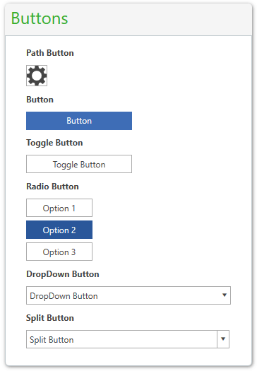

# Overview







Thank you for choosing Telerik __RadButtons__!

__RadButtons__ for {{ site.framework_name }} is a set of customizable buttons allowing you to build complex forms and to easily manage the user input.  You can style the control consistently with the other controls from UI for {{ site.framework_name }} and get advantage of the Command support that RadButtons provide.

# Key Features

This is a list with short descriptions of the top-of-the-line features of Telerik's __RadButtons__.

* __DropDown Button__: Provides menu-like interface model within a button. It can be very handy for creating more simplistic UI where extensive menus and/or ComboBoxes are not needed. Any kind of content can be placed in the pop-up area displayed upon the activation of the button. Read more about this in the [DropDown Button]() article.

* __Split Button__: Extends the __DropDown Button's__ functionality with an action area like in a standard button. The button implements the __IsChecked__ state, too. Read more about this in the [Split Button]() article.

* __Toggle Button__: Mimics the functionality of a check box, but has more flexibility in its design. It offers state management based on the check state of the control. Read more about this in the [Toggle Button]() article.

* __Radio Button__: Mimics the functionality of the radio button, but has more flexibility in its design. Read more about this in the [Radio Button]() article.

* __Path Button__: Derives from RadButton, but provides the ability to set a Path alongside its content. Read more about this in the [Path Button]() article.

* __Command Support__: Full implementation of the Command pattern is available by using RadButtons. You can build complex UIs and keep your code simple by using Commands. Read more about this in the [Commands]() article.

>tip Get started with the control with its [Getting Started]() help article that shows how to use it in a basic scenario.

> Check out the control demos at [demos.telerik.com](http://demos.telerik.com/silverlight/#Buttons/FirstLook)[demos.telerik.com](http://demos.telerik.com/wpf/)

## See Also
 * [Visual Structure]() 
 * [Events]()
 * [Styles and Templates]()