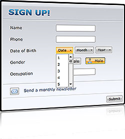

# Overview







## 

Thank you for choosing Telerik __RadButtons__!

__RadButtons__ for SilverlightWPF is a set of customizable buttons allowing you to build complex forms and to easily manage the user input.  You can style the control consistently with the other RadControls and get advantage of the Command support that __RadButtons__ provide.

This is a list with short descriptions of the top-of-the-line features of Telerik's __RadButtons__:

* __DropDown Button__ - provides menu-like interface model within a button. It can be very handy for creating more simplistic UI where extensive menus and/or ComboBoxes are not needed. Any kind of content can be placed in the pop-up area displayed upon the activation of the button. [Read more]()

* __Split Button__ - extends the __DropDown Button's__ functionality with an action area like in a standard button. The button implements the __IsChecked__ state, too. [Read more]()

* __Toggle Button__ - mimics the functionality of a check box, but has more flexibility in its design. It offers state management based on the check state of the control.[Read more]()

* __Radio Button__ - mimics the functionality of the radio button, but has more flexibility in its design. [Read More]()

* __Command Support__ - full implementation of the Command pattern is available by using __RadButtons__. You can build complex UIs and keep your code simple by using Commands. [Read more]()

* __VS Plug-in for Testing RadControls__ - Finally an [automated testing tool](http://www.telerik.com/products/web-testing-tools.aspx) built for developers. Record cross-browser tests, customize them in code within Visual Studio or convert them to unit tests. Even more, WebUI Test Studio is the best way to test RadControls for ASP.NET AJAX or Silverlight. The powerful test recorder automatically detects the controls and exposes commonly used verifications. [Read more](http://www.telerik.com/products/web-testing-tools.aspx)

# See Also

 * [Visual Structure]()

 * [Getting Started]()

 * [Events]()

 * [Styles and Templates]()
