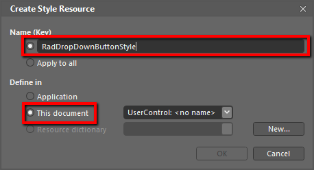
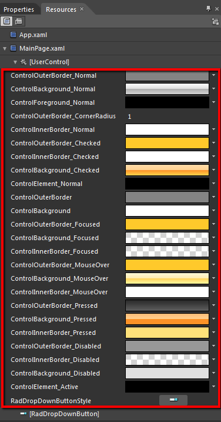

# Styling the RadDropDownButton

The __RadDropDownButton__ can be styled by creating an appropriate __Style__ and setting it to the __Style__ property of the control. 

You have two options:

* To create an empty style and set it up on your own. 

* To copy the default style of the control and modify it.

This topic will show you how to perform the second one.

## Modifying the Default Style

To copy the default style, load your project in Expression Blend and open the User Control that holds the __RadDropDownButton__. In the 'Objects and Timeline' pane select the __RadDropDownButton__ you want to style. From the menu choose *Object -> Edit Style -> Edit a Copy*. You will be prompted for the name of the style and where to be placed.

>tip If you choose to define the style in Application, it would be available for the entire application. This allows you to define a style only once and then reuse it where needed.

After clicking 'OK', Expression Blend will generate the default style of the __RadDropDownButton__ control in the __Resources__ section of your User Control. The properties available for the style will be loaded in the 'Properties' pane and you will be able to modify their default values. You can also edit the generated XAML in the XAML View or in Visual Studio.

If you go to the 'Resources' pane, you will see an editable list of resources generated together with the style and used by it. In this list you will find the brushes, styles and templates needed to change the visual appearance of the __RadDropDownButton.__ Their names indicate to which part of the __RadDropDownButton__ appearance they are assigned.



* __ControlOuterBorder_Normal__ - a brush that represents the outer border color of the button, when it is in __Normal__ state.

* __ControlBackground_Normal__ - a brush that represents the background color of the button, when it is in __Normal__ state.

* __ControlForeground_Normal__ - a brush that represents the foreground color of the button, when it is in __Normal__ state.

* __ControlOuterBorder_CornerRadius__ - represents the value for the radius of the button's corners.

* __ControlInnerBorder_Normal__ -  a brush that represents the inner border color of the button, when it is in __Normal__ state.

* __ControlOuterBorder_Checked__ - a brush that represents the outer border color of the button, when it is checked.

* __ControlInnerBorder_Checked__ - a brush that represents the inner border color of the button, when it is checked.

* __ControlBackground_Checked__ - a brush that represents the background color of the button, when it is checked.

* __ControlElement_Normal__ - a brush that represents the fill color of the drop down indicator.

* __ControlOuterBorder__ - a brush that represents the border color of the drop down area.

* __ControlBackground__ - a brush that represents the background color of the drop down area.

* __ControlOuterBorder_Focused__ -  a brush that represents the outer border color of the button, when it is focused.

* __ControlBackground_Focused__ - a brush that represents the background color of the button, when it is focused.

* __ControlInnerBorder_Focused__ - a brush that represents the inner border color of the button, when it is focused.

* __ControlOuterBorder_MouseOver__ - a brush that represents the outer border color of the button, when the mouse is over it.

* __ControlBackground_MouseOver__ - a brush that represents the background color of the button, when the mouse is over it.

* __ControlInnerBorder_MouseOver__ - a brush that represents the inner border color of the button, when the mouse is over it.

* __ControlOuterBorder_Pressed__ - a brush that represents the outer border color of the button, when it is pressed.

* __ControlBackground_Pressed__ - a brush that represents the background color of the button, when it is pressed.

* __ControlInnerBorder_Pressed__ - a brush that represents the inner border color of the button, when it is pressed.

* __ControlOuterBorder_Disabled__ - a brush that represents the outer border color of the button, when it is disabled.

* __ControlInnerBorder_Disabled__ - a brush that represents the inner border color of the button, when it is disabled.

* __ControlBackground_Disabled__ - a brush that represents the background color of the button, when it is disabled.

* __ControlElement_Active__ - a brush that represents the fill color of the drop down indicator, when the drop down is opened.

* __RadDropDownButtonStyle__ - the default __Style__ for the __RadDropDownButton__. 

## See Also
 * [DropDown Button]()
 * [Template Structures]()
 * [Styling the ButtonChrome]()