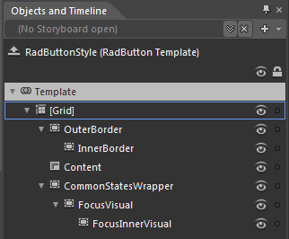
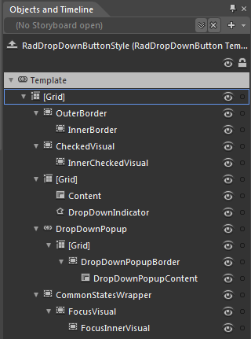
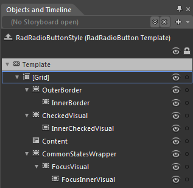
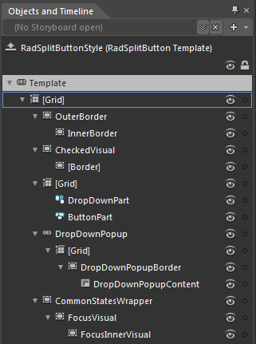
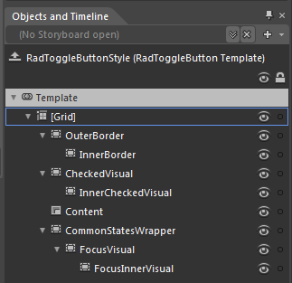

# Template Structures

Like most controls, the __RadButtons__ also allow you to template them in order to be changed from the inside. Except for templating the whole control, you can template only parts of it. This topic will make you familiar with the structure of the __RadButtons'__ templates.

## RadButton

Here is a snapshot from Expression Blend.

The template contains the following parts.

* __[Grid]__ - hosts the layout of the __RadButton__ and is of type __Grid__.
						

* __OuterBorder__ - a __Border__ control that represents the outer border of the __RadButton__

* __InnerBorder__ - a __Border__ control that represents the background and the inner border of the __RadButton__

* __Content__ - displays the button's content and is of type __ContentPresenter__.

* __CommonStatesWrapper__ - a __Border__ control that hosts the __RadButton__'s focused visual state control elements

* __FocusVisual__ - a __Border__ control that represents the background and the outer border of the __RadButton__, when it is focused
										

* __FocusInnerVisual__ - a __Border__ control that represents the inner border of the __RadButton__, when it is focused
											

## RadDropDownButton

Here is a snapshot from Expression Blend.

The template contains the following parts.

* __[Grid]__ - hosts the layout of the __RadDropDownButton__ and is of type __Grid__.

* __OuterBorder__ - a  __Border__ control that represents the outer border of the __RadDropDownButton__.

* __InnerBorder__ - a __Border__ control that represents the background and the inner border of the __RadDropDownButton__.

* __CheckedVisual__ - a __Border__ control that represents the outer border of the __RadDropDownButton__, when its __DropDownContent__ is opened.

* __InnerCheckedVisual__ - a __Border__ control that represents the background and the inner border of the __RadDropDownButton__, when its __DropDownContent__ is opened.

* __[Grid]__ - a __Grid__ control that hosts the layout for the drop down and the button parts of the __RadDropDownButton__.

* __Content__ - displays the content of the button and is of type __ContentPresenter__.

* __DropDownIndicator__ - represents the arrow indicator for the drop down part and is of type __Path__.

* __DropDownPopup__ - represents the drop down area and is of type __Popup__.

* __[Grid]__ - a __Grid__ control that hosts the __RadDropDownButton.DropDownContent__ elements.

* __DropDownPopupBorder__ - represents the background and the border of the drop down area and is of type __Border__.

* __DropDownPopupContent__ - displays the content of the drop down area and is of type __ContentPresenter__.

* __CommonStatesWrapper__ - a __Border__ control that hosts the __RadDropDownButton's__ focused visual state control elements.

* __FocusVisual__ - a __Border__ control that represents the background and the outer border of the __RadDropDownButton__, when it is focused.

* __FocusInnerVisual__ - a __Border__ control that represents the inner border of the __RadDropDownButton__, when it is focused.

## RadRadioButton

Here is a snapshot from Expression Blend.

The template contains the following parts.

* __[Grid]__ - hosts the layout of the __RadRadioButton__ and is of type __Grid__.

* __OuterBorder__ - a __Border__ control that represents the outer border of the __RadRadioButton__.

* __InnerBorder__ - a __Border__ control that represents the background and the inner border of the __RadRadioButton__.

* __CheckedVisual__ - a __Border__ control that represents the outer border of the __RadRadioButton__, when it is checked.

* __InnerCheckedVisual__ - a __Border__ control that represents the background and the inner border of the __RadRadioButton__, when it is checked.

* __Content__ - displays the button's content and is of type __ContentPresenter__.

* __CommonStatesWrapper__ - a __Border__ control that hosts the __RadRadioButton__'s focused visual state control elements.

* __FocusVisual__ - a __Border__ control that represents the background and the outer border of the __RadRadioButton__, when it is focused.

* __FocusInnerVisual__ - a __Border__ control that represents the inner border of the __RadRadioButton__, when it is focused.

## RadSplitButton

Here is a snapshot from Expression Blend.

The template contains the following parts.

* __[Grid]__ - hosts the layout of the __RadSplitButton__and is of type __Grid__.

* __OuterBorder__ - a  __Border__ control that represents the outer border of the __RadSplitButton__.

* __InnerBorder__ - a __Border__ control that represents the background and the inner border of the __RadSplitButton__.

* __CheckedVisual__ - a __Border__ control that represents the outer border of the __RadSplitButton__, when its __DropDownContent__ is opened.

* __[Border]__ - a __Border__ control that represents the background and the inner border of the __RadSplitButton__, when its __DropDownContent__ is opened.

* __[Grid]__ - a __Grid__ control that hosts the layout for the drop down and the button parts of the __RadSplitButton.__

* __DropDownPart__ - represents the part responsible for opening the drop down area and is of type __RadToggleButton__.

* __ButtonPart__ - represents the clickable part of the split button and is of type __RadButton__.

* __DropDownPopup__ - represents the drop down area and is of type __Popup__.

* __[Grid]__ - a __Grid__ control that hosts the __RadSplitButton.DropDownContent__elements.

* __DropDownPopupBorder__ - represents the background and the border of the drop down area and is of type __Border__.

* __DropDownPopupContent__ - displays the content of the drop down area and is of type __ContentPresenter__.

* __CommonStatesWrapper__ - a __Border__ control that hosts the __RadSplitButton__'s focused visual state control elements.

* __FocusVisual__ - a __Border__ control that represents the background and the outer border of the __RadSplitButton__, when it is focused.

* __FocusInnerVisual__ - a __Border__ control that represents the inner border of the __RadSplitButton__, when it is focused.

## RadToggleButton

Here is a snapshot from Expression Blend.

The template contains the following parts.

* __[Grid]__ - hosts the layout of the __RadToggleButton__ and is of type __Grid__.
						

* __OuterBorder__ - a __Border__ control that represents the outer border of the __RadToggleButton__

* __InnerBorder__ - a __Border__ control that represents the background and the inner border of the __RadToggleButton__

* __CheckedVisual -__a __Border__ control that represents the outer border of the __RadToggleButton__, when it is checked
								

* __InnerCheckedVisual -__a __Border__ control that represents the background and the inner border of the __RadToggleButton__, when it is checked
									

* __Content__ - displays the button's content and is of type __ContentPresenter__.
							

* __CommonStatesWrapper__ - a __Border__ control that hosts the __RadToggleButton__'s focused visual state control elements
								

* __FocusVisual__ - a __Border__ control that represents the background and the outer border of the __RadToggleButton__, when it is focused
										

* __FocusInnerVisual__ - a __Border__ control that represents the inner border of the __RadToggleButton__, when it is focused
											

# See Also

 * [Styling the ButtonChrome]()

 * [Styling the RadButton]()

 * [Styling the RadDropDownButton]()

 * [Styling the RadRadioButton]()

 * [Styling the RadSplitButton]()

 * [Styling the RadToggleButton]()
