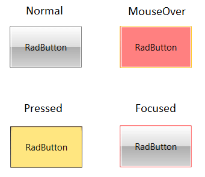
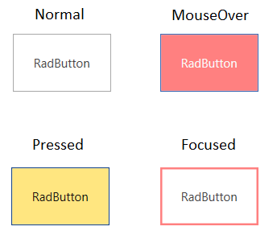

# Styling Visual States

This article will show you how to change the default colors applied when you enter the different visual states of [RadButton]() - __MouseOver, Pressed, Disabled__, etc.

> The article is created with RadButton in mind, but the same guidelines can be used with any other control from the RadButton suite. In few words, you need to find the corresponding Trigger, VisualState object or a visual element, and change a property (Background, BorderBrush, etc.).

>tip The Material, Fluent, Crystal themes expose an easy mechanism to style most visual states without the need of the following steps. Read more about this in the [Material Theme](), the [Fluent Theme]() and the [Crystal Theme]() articles.

## Step 1: Extracting the Default Template

The first thing to do would be to define a RadButton in XAML and extract its default Style. Read how to do this in the [Editing ControlTemplates]() article. Basically, you will need to use the Visual Studio designer or copy the XAML manually in your project.

This article will demonstrate how to modify the visual states in the __Office2016__ and the __Office_Black__ themes as they show the two main template structures used accross the Telerik [themes]().

## Step 2: Applying Changes in the ControlTemplate of the Button

The next code snippets show runnable XAML with the default Style (for the Office_Black and Office2016 themes) of RadButton customized. Note that the Office_Black theme uses __VisualState__ objects to animate its visual states.

Note the following:  

* The Office_Black theme uses __VisualState__ objects to animate its visual states.

* The Office2016 theme uses __Trigger__ objects to animate its visual states.

In the next snippets the ControlTemplate of each Style will be modified in such a manner that it will change colors in the following visual states - __Pressed, MouseOver__ and __Focused__. To change the colors of any other visual state like Disabled, find the corresponding VisualState, Trigger or a visual element in the ControlTemplate and set the corresponding property - for example: Background, Fill, BorderBrush, etc.

>important The changes applied in the ControlTemplate (in the following code) are marked with comments using the pattern "Changed OldValue to NewValue". For example: "Changed Background from "{StaticResource ControlBackground_MouseOver}" to "#FF8080:" ".

__Example 1: Customized RadButton Style - based on the Office_Black Theme__
<snippet id='radbuttons-styling-visual-states-example_1_customized_radbutton_style_based_on_the_office_black_theme-xaml' />

#### Figure 1: Office_Black RadButton with customized visual states

__Example 2: Customized RadButton Style - based on the Office2016 Theme__
<snippet id='radbuttons-styling-visual-states-example_2_customized_radbutton_style_based_on_the_office2016_theme-xaml' />

#### Figure 2: Office2016 RadButton with customized visual states

>important The general idea for customizing the colors of the control in its different states, is to find the right VisualState, a Trigger or visual element (for example, Border) and set the correct property - Background, Fill, Opacity, etc. The exact modification depends on the desired effect.

You can find a runnable example showing the modifications described in this article, in the [CustomizeVisualStates](https://github.com/telerik/xaml-sdk/tree/master/Buttons/CustomizeVisualStates) SDK example.

## See Also
 * [Commands]()
 * [Getting Started]()
 * [Modifying Default Styles]()
