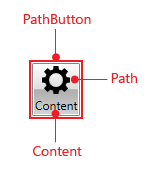
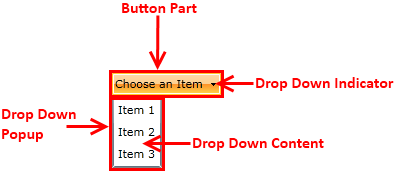
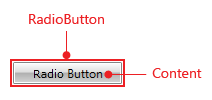
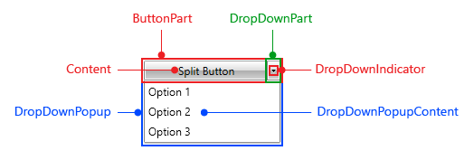
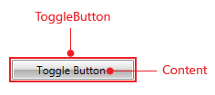
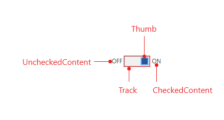

# Visual Structure

This section defines the terms and concepts used in the scope of __RadButtons__ that you have to get familiar with prior to continuing with the rest of the article. They can also be helpful in order to describe your issue better when contacting our support service. Below you can see snapshots and explanations of the main states and visual elements of the standard __RadButton__ controls.

## RadButton

* __Content__ - represents the content of the button.

* __Button Part__ - represents the active part of the control.

## RadPathButton

* __Content__ - represents the content of the button.            

* __Path__ - represents the Path of the control.            

* __Button Part__ - represents the active part of the control.            

## RadDropDownButton

* __Content__ - represents the content of the button.

* __Drop Down Indicator__ - represents the arrow indicator.

* __Button Part__ - represents the active part of the control.

* __Drop Down Popup__- represents the drop down popup.

* __Drop Down Content__- represents the content of the drop down popup.

## RadRadioButton

* __Content__ - represents the content of the button.

* __Button Part__ - represents the active part of the control.

## RadSplitButton

* __Content__ - represents the content of the button.

* __Drop Down Indicator__ - represents the arrow indicator.

* __Button__ - represents the active part of the control.

* __Drop Down Part__- represents the part which opens the popup.

* __Drop Down Popup__- represents the drop down popup.

* __Drop Down Content__- represents the content of the drop down popup.

## RadToggleButton

* __Content__ - represents the content of the button.

* __Button Part__ - represents the active part of the control.

## RadToggleSwitchButton

* __CheckContent__: Represents the check content of the button.
* __UncheckContent__: Represents the uncheck content of the button.
* __Thumb__: Represents the thumb part of the control.
* __Track__: Represents the track part of the control.

## See Also
 * [Getting Started]()
 * [Appearance]() 
