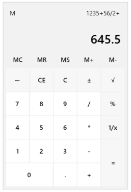

# Overview

## 



						   
					  

						   
					  

Thank you for choosing Telerik RadCalculator!

__RadCalculator__ for SilverlightWPF has a simple easy-to-use interface enabling the end user to perform all basic calculations such as addition, subtraction, multiplication, division as well as some more complicated ones – reciprocal, square root, negate. The operations can be executed either by clicking the calculator buttons, or by using your keyboard. You can also use the numeric keypad to type numbers and operators by pressing Num Lock. Furthermore, all the Memory and Clear features are exposed as well.
			  

____

__RadCalculator__ key features list:
			  

* 
					  Basic calculations - addition, subtraction, multiplication, division.
				  

* 
					  Additional calculations like - negate, squate root, reciprocal.
				  

* 
					 Keyboard support.
				  

* 
					 Memory functionality.
				  

* 
					  Clear entry, clear all, delere functionality.
				  

* 
					  Customized functions.
				  

* 
					 UI Automation Support
				  

* 					 
						  All Telerik controls for WPFSilverlight support styling with Expression Blend					  
				  
