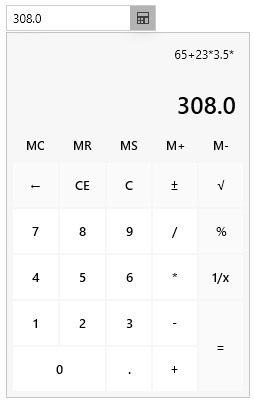
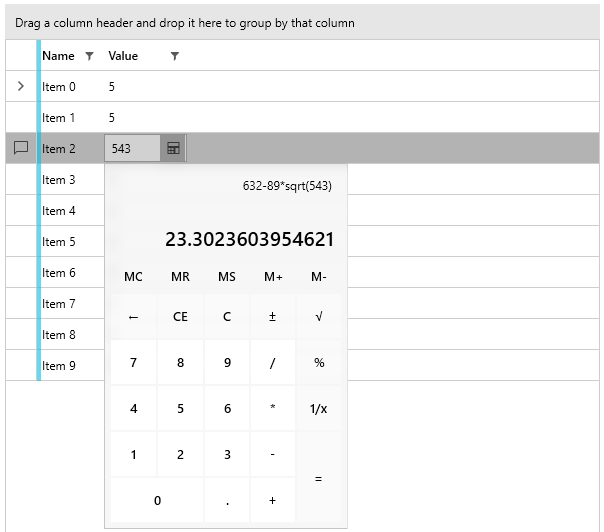

# Calculator Picker

The `RadCalculatorPicker` control is a drop down button with a `RadCalculator` in its drop down content. The button content shows the calculated value of the calculator.

__Defining RadCalculatorPicker__
```XAML
	<telerik:RadCalculatorPicker Height="30" Width="200" />		
```

__RadCalculatorPicker example__  



The drop down state can be controlled manually with the `IsDropDownOpen` property of `RadCalculatorPicker`.

__Opening the drop down content in code__
```C#
	this.calculatorPicker.IsDropDownOpen = true;
```

## DataGrid Integration

The following example shows how to utilize the `RadColorPicker` control as the cell editing element of a `RadGridView` column. To do so, define a custom `CellEditTemplate` for the column and in the `DataTemplate` add the calculator.

__Defining a model for the RadGridView rows__
```C#
	public class RowInfo
    {
        public string Name { get; set; }
        public double Value { get; set; }
    }
```

__Populating the data source__
```C#
	public MainWindow()
	{		
		InitializeComponent();
		var source = new ObservableCollection<RowInfo>();
		for (int i = 0; i < 10; i++)
		{
			source.Add(new RowInfo() { Name = "Item " + i, Value = 5 });
		}
		DataContext = source;
	}
```

__Defining the RadGridView and setting up the RadCalculatorPicker as the cell edit element__
```XAML
	<telerik:RadGridView GroupRenderMode="Flat"
						 ItemsSource="{Binding}"						 
						 AutoGenerateColumns="False">
		<telerik:RadGridView.Columns>
			<telerik:GridViewDataColumn DataMemberBinding="{Binding Name}"/>
			<telerik:GridViewDataColumn DataMemberBinding="{Binding Value}">
				<telerik:GridViewDataColumn.CellEditTemplate>
					<DataTemplate>
						<telerik:RadCalculatorPicker Value="{Binding Value, Mode=TwoWay}" />
					</DataTemplate>
				</telerik:GridViewDataColumn.CellEditTemplate>
			</telerik:GridViewDataColumn>
		</telerik:RadGridView.Columns>
	</telerik:RadGridView>
```

__Using RadCalculatorPicker as a cell editor of RadGridView__  



## See Also  
* [Getting Started]()
