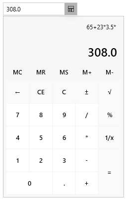
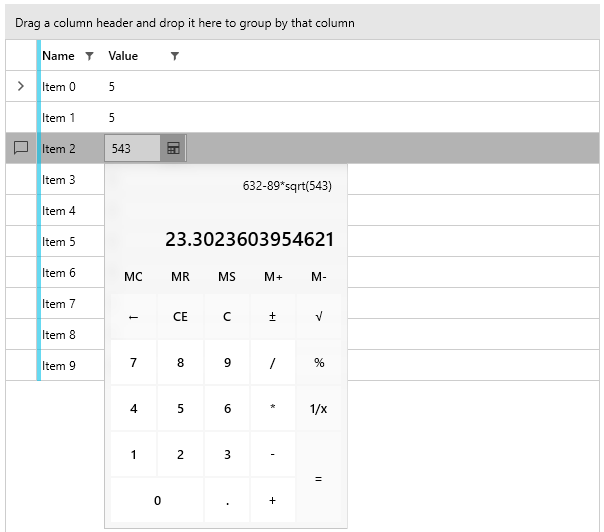

# Calculator Picker

The `RadCalculatorPicker` control is a drop down button with a `RadCalculator` in its drop down content. The button content shows the calculated value of the calculator.

__Defining RadCalculatorPicker__
<snippet id='radcalculator-calculatorpicker-defining_radcalculatorpicker-xaml' />

__RadCalculatorPicker example__  

The drop down state can be controlled manually with the `IsDropDownOpen` property of `RadCalculatorPicker`.

__Opening the drop down content in code__
<snippet id='radcalculator-calculatorpicker-opening_the_drop_down_content_in_code-cs' />

## DataGrid Integration

The following example shows how to utilize the `RadColorPicker` control as the cell editing element of a `RadGridView` column. To do so, define a custom `CellEditTemplate` for the column and in the `DataTemplate` add the calculator.

__Defining a model for the RadGridView rows__
<snippet id='radcalculator-calculatorpicker-defining_a_model_for_the_radgridview_rows-cs' />

__Populating the data source__
<snippet id='radcalculator-calculatorpicker-populating_the_data_source-cs' />

__Defining the RadGridView and setting up the RadCalculatorPicker as the cell edit element__
<snippet id='radcalculator-calculatorpicker-defining_the_radgridview_and_setting_up_the_radcalculatorpicker_as_the_cell_edit_element-xaml' />

__Using RadCalculatorPicker as a cell editor of RadGridView__  

## See Also  
* [Getting Started]()
