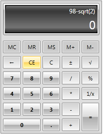
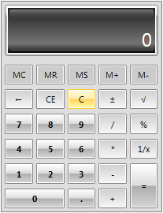

# Clear Functionality

__RadCalculator__ supports all native clear functionality the end user is accustomed with.
		  

* __Delete__ - deletes the last digit from the displayed number.
				  

* __Clear Entry (CE)__ - clears the current input value:

* __Clear (C)__ - clears the input value, the calculated value and the history:

## See Also

 * [Memory Functionality]()

 * [Keyboard Support]()
