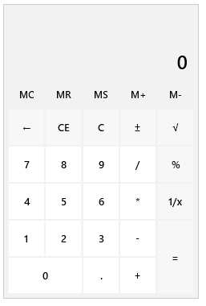
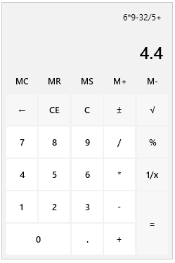
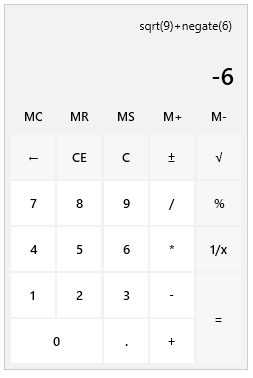
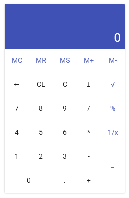

# Getting Started with {{ site.framework_name }} Calculator

This tutorial will walk your through the creation of a sample application that contains `RadCalculator`.		  

## Adding Telerik Assemblies Using NuGet

To use `RadCalculator` when working with NuGet packages, install the `Telerik.Windows.Controls.Input.for.Wpf.Xaml` package. The [package name may vary]() slightly based on the Telerik dlls set - [Xaml or NoXaml]()

Read more about NuGet installation in the [Installing UI for WPF from NuGet Package]() article.

>tip With the 2025 Q1 release, the Telerik UI for WPF has a new licensing mechanism. You can learn more about it [here]().

## Adding Assembly References Manually

If you are not using NuGet packages, you can add a reference to the following assemblies:

* __Telerik.Licensing.Runtime__
* __Telerik.Windows.Controls__
* __Telerik.Windows.Controls.Input__
		
## Adding RadCalculator to the Project

__Defining RadCalculator__  
```XAML		
		<telerik:RadCalculator />		
```

#### __RadCalculator example__


The calculated value can be accessed via the `Value` property of `RadCalculator`.

The current history can be accessed via the `History` property of `RadCalculator`.

## Performing Calculations

`RadCalculator` allows you to perform all the basic calculations - __addition, subtraction, multiplication, division__. All of them can be executed either by the corresponding buttons or through the keyboard. Once a particular operation is executed, the history is updated accordingly.

__Basic Calculations with RadCalculator__  



`RadCalculator` allows you to perform also a couple of more complex calculations - __square root, reciprocal, percent, negate__. All of them can be executed either by the corresponding buttons or through the keyboard. 

__Complex Calculations with RadCalculator__  



## Setting a Theme

The controls from our suite support different themes. You can see how to apply a theme different than the default one in the [Setting a Theme]() help article.

>important Changing the theme using implicit styles will affect all controls that have styles defined in the merged resource dictionaries. This is applicable only for the controls in the scope in which the resources are merged. 

To change the theme, you can follow the steps below:

* Choose between the themes and add reference to the corresponding theme assembly (ex: **Telerik.Windows.Themes.Material.dll**). You can see the different themes applied in the **Theming** examples from our [WPF Controls Examples](https://demos.telerik.com/wpf/)[Silverlight Controls Examples](https://demos.telerik.com/silverlight/#Calculator/Theming) application.

* Merge the ResourceDictionaries with the namespace required for the controls that you are using from the theme assembly. For the `RadCalculator`, you will need to merge the following resources:

	* __Telerik.Windows.Controls__
	* __Telerik.Windows.Controls.Input__

__Example 2__ demonstrates how to merge the ResourceDictionaries so that they are applied globally for the entire application.

__Merge the ResourceDictionaries__  
```XAML
	<Application.Resources>
		<ResourceDictionary>
			<ResourceDictionary.MergedDictionaries>
				<ResourceDictionary Source="/Telerik.Windows.Themes.Material;component/Themes/System.Windows.xaml"/>
				<ResourceDictionary Source="/Telerik.Windows.Themes.Material;component/Themes/Telerik.Windows.Controls.xaml"/>
				<ResourceDictionary Source="/Telerik.Windows.Themes.Material;component/Themes/Telerik.Windows.Controls.Input.xaml"/>
			</ResourceDictionary.MergedDictionaries>
		</ResourceDictionary>
	</Application.Resources>
```

>Alternatively, you can use the theme of the control via the [StyleManager](https://docs.telerik.com/devtools/wpf/styling-and-appearance/stylemanager/common-styling-apperance-setting-theme-wpf)[StyleManager](https://docs.telerik.com/devtools/silverlight/styling-and-appearance/stylemanager/common-styling-apperance-setting-theme).
	
__RadCalculator with the Material theme__  




## Telerik UI for WPF Learning Resources

* [Telerik UI for WPF Calculator Component](https://www.telerik.com/products/wpf/calculator.aspx)
* [Getting Started with Telerik UI for WPF Components]()
* [Telerik UI for WPF Installation]()
* [Telerik UI for WPF and WinForms Integration]()
* [Telerik UI for WPF Visual Studio Templates]()
* [Setting a Theme with Telerik UI for WPF]()
* [Telerik UI for WPF Virtual Classroom (Training Courses for Registered Users)](https://learn.telerik.com/learn/course/external/view/elearning/16/telerik-ui-for-wpf) 
* [Telerik UI for WPF License Agreement](https://www.telerik.com/purchase/license-agreement/wpf-dlw-s)


## See Also  
* [Calculator Picker]()
