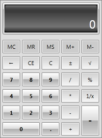
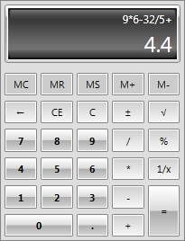
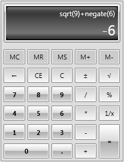

# Getting Started

This tutorial will walk your through the creation of a sample application that contains __RadCalculator__ and will show you how to:
		  
* Use RadCalculator in your project

* Perform basic calculations

* Perform more complicated calculations

For the purpose of this example, you will need to create an empty SilverlightWPF Application project and open it in Visual Studio.

* [Assembly References](#assembly-references)
* [Adding RadCalculator to the Project](#adding-radcalculator-to-the-project)
* [Performing basic calculations with RadCalculator](#performing-basic-calculations-with-radcalculator)
* [Performing complex calculations with RadCalculator](#performing-complex-calculations-with-radcalculator)

## Assembly References

In order to use __RadCalculator__ in your projects, you have to add reference to the following assemblies:

* __Telerik.Windows.Controls__
* __Telerik.Windows.Controls.Input__
		  
## Adding RadCalculator to the Project

#### __[XAML] Example 1: Defining RadCalculator__

{{region xaml-radcalculator-getting-started_0}}

	<UserControl x:Class="RadCalculator.MainPage"
	             xmlns="http://schemas.microsoft.com/winfx/2006/xaml/presentation"
	             xmlns:x="http://schemas.microsoft.com/winfx/2006/xaml"
	             xmlns:d="http://schemas.microsoft.com/expression/blend/2008"
	             xmlns:mc="http://schemas.openxmlformats.org/markup-compatibility/2006"
	             xmlns:telerik="http://schemas.telerik.com/2008/xaml/presentation"
	             xmlns:my="clr-namespace:RadCalculator"
	             mc:Ignorable="d" d:DesignHeight="700" d:DesignWidth="700">   
	  
		<Grid x:Name="LayoutRoot" Background="White" >
			<telerik:RadCalculator />		
	    </Grid>
	</UserControl>
	{{endregion}}

Now if you run the application, you will have a RadCalculator:

#### __Figure 1: Defining RadCalculator__

## Performing Basic Calculations with RadCalculator

__RadCalculator__ allows you to perform all the basic calculations - addition, subtraction, multiplication, division. All of them can be executed either by the corresponding buttons or through the keyboard. Once a particular operation is executed, the history is updated accordingly:

#### __Figure 2: Basic Calculations with RadCalculator__

## Performing Complex Calculations with RadCalculator

__RadCalculator__ allows you to perform a couple of more complex calculations - square root, reciprocal, percent, negate. All of them can be executed either by the corresponding buttons or through the keyboard. Once a particular operation is executed, the history is updated accordingly:

#### __Figure 3: Complex Calculations with RadCalculator__

## See Also

* [RadCalculatorPicker Getting Started]()
