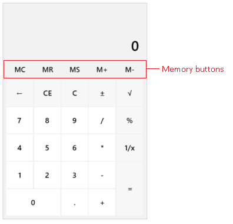
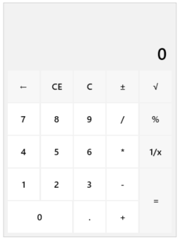

# Memory Support

The __Calculator__ component supports all native memory functionality the end user is accustomed with. 



The following list shows the supported memory actions with example.

* __Memory Plus (M+)__&mdash;Adds the current input into the memory.

	Example:  

	1. Input - '3' -> M+ -> Memory Value - '3'
	1. Input - '6' -> M+ -> Memory Value - '9'

* __Memory Minus (M-)__&mdash;Substracts the current input value from the memory value.

	Example:  

	1. Input - '5' -> M- -> Memory Value - '-5'
	1. Input - '6' -> M- -> Memory Value - '-11'

* __Memory Store (MS)__&mdash;Stores the current input value into the memory. For example:

	Example:  
	
	1. Input - '42' -> MS -> Memory Value - '42'
	1. Input - '82' -> MS -> Memory Value - '82'

* __Memory Recall (MR)__&mdash;Displays the value stored into the memory.

	Example:  
	
	1. Input - '42' -> MR -> Memory Value - '42'
	1.  MR -> Displayed Value - '42'

* __Memory Clear (MC)__&mdash;Clears the memory value.

The current memory value can be assigned manually by setting the `MemoryValue` property.

__Setting the memory value manually__
```XAML
	<telerik:RadCalculator MemoryValue="2"/>
```

## Hiding the Memory Buttons

To hide the buttons, set the `MemoryButtonsVisibility` property of `RadCalculator` or `RadCalculatorPicker` to `Collapsed`.

__Hiding the memory buttons__
```XAML
	<telerik:RadCalculator MemoryButtonsVisibility="Collapsed"/>
```



## See Also  
 * [Clear Functionality]()
 * [Keyboard Support]()
