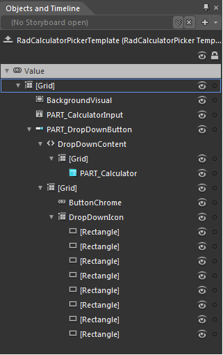

# RadCalculatorPicker Template Structure

Like most SilverlightWPF controls, RadCalculatorPicker allows you to template it in order to change the control from inside. Except for templating the whole control, you can template parts of it or even independent controls related to it.
		  

>tip
			  To learn how to style SilverlightWPF RadControls read the common topics about Styling and Appearance. If you are new to the controls, they will give you the basic knowledge about it.
		  

## RadCalculatorPicker Template Structure:

* __Grid__ - hosts the elements of the template and is of type Grid.
				  

* __BackgroundVisual__ - It represents the border and the background of the RadCalculatorPicker and is of type Border.
				  

* __PART_CalculatorInput__ - a single TextBox control which is used to display RadCalculatorPicker’s Value.
				  

* __PART_DropDownButton__ - represents the drop down button which shows RadCalculatorPicker’s content and is of type RadDropDownButton.
				  

* __DropDownContent__ - represents the DropDownContent of the drop down button.
				  

* __Grid__ - a simple grid which hosts RadCalculatorPicker’s content.
				  

* __PART_Calculator__ - a standalone Radcalculator  which is used by the picker for calculations.
				  

* __Grid__

* __ButtonChrome__ - represents the drop-down button and is of type Telerik.Windows.Controls.Chromes.
				  

* __DropDownIcon__ - hosts the rectangles for the indicator of the drop down icon and it is of type Grid.
				  

* __Rectangle__

* __Rectangle__

* __Rectangle__

* __Rectangle__

* __Rectangle__

* __Rectangle__

* __Rectangle__

* __Rectangle__

## RadCalculatorPicker Resources:

* __CalculatorPicker_Background__ - a brush which is used to paint the background of RadCalculatorPicker.
			  

* __CalculatorPicker_BorderBrush__ - a brush that represents the border color of RadCalculatorPicker.
			  

* __CalculatorPicker_Foreground__ - a brush that represents the foreground color of RadCalculatorPicker.
			  

